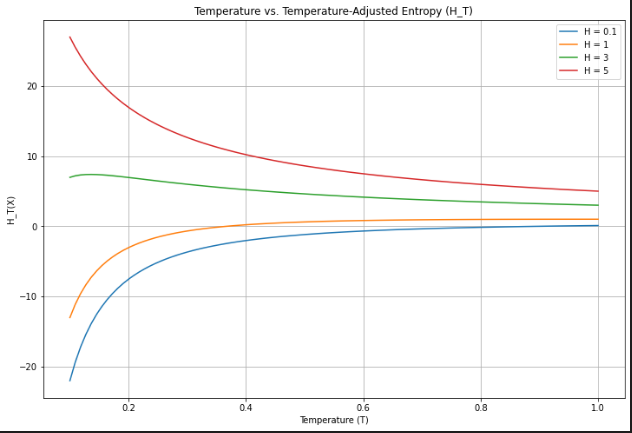
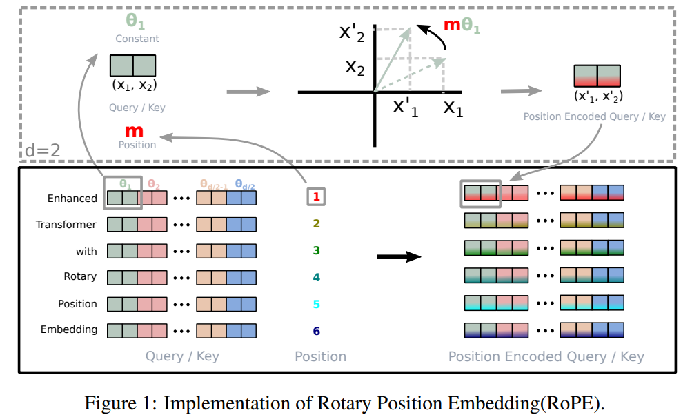

## Tokenization

The number of words per token depends on the tokenization method and the language of the text. For English text, a helpful rule of thumb is that one token generally corresponds to ~4 characters of text or ~0.75 words. This means that 100 tokens are roughly equivalent to 75 words. However, this may vary for other languages or formats, as tokens can include trailing spaces and even sub-words1. For example, in Polish, the word ‘przepytonowany’ is split into six tokens: pr, z, ep, ython, ow and any.

Visualize GPT-3 tokenization: https://platform.openai.com/tokenizer

Suggested Reading https://help.openai.com/en/articles/4936856-what-are-tokens-and-how-to-count-them

## Decoding Strategies

Suggested Reading
- [Blog by Hugging Face](https://huggingface.co/blog/how-to-generate)

### Greedy Decoding

In greedy decoding, we select the word with the highest probability at each step. This strategy is used to generate text when we want to maximize the probability of the generated text. However, it can lead to the model getting stuck in a local optimum and not generating the best possible text. It leads to model generating repetitive text.

### Temperature

Temperature is used to modify the probability distribution of the predicted words and hence control the randomness of the generated text. The higher the temperature, the more random/diverse is the generated text.

The formula for calculating the probability of the next word given the previous words is as follows:

$$ P(w_i|w_{i-1}, w_{i-2}, \dots, w_0) = \frac{\exp(\frac{\log(P(w_i|w_{i-1}, w_{i-2}, \dots, w_0))}{T})}{\sum_{w_j \in V} \exp(\frac{\log(P(w_j|w_{i-1}, w\_{i-2}, \dots, w_0))}{T})} $$

where $T$ is the temperature, $V$ is the vocabulary and $w_i$ is the ith word in the sequence.

For example, let the probability distribution of the next word be [0.1, 0.2, 0.3, 0.4] and the temperature be 2. The probability distribution after applying the temperature becomes [0.05, 0.1, 0.15, 0.2]. Increasing the temperature reduces the distance between the probabilities of the words in the vocabulary (0.1 - 0.05) as compared to (0.2 - 0.1). The inverse of temperature $1/T = \beta$ is also frequently used. When $\beta = 0$, the temperature is infinite and the model generates random text. When $\beta = \inf$, the temperature is zero and the model samples the word with the highest probability.

A temperature of 0.7 is high enough entropy to cause hallucinations. Anything around or above 0.9 is very high entropy and is likely to generate gibberish. For deterministic output, set temperature to a very low value like 0.01.

#### Entropy and Temperature

The affect of temperature of entropy can be seen using the formula for entropy:

$$ H(X) = -\sum_{i=1}^n P(x_i)\log(P(x_i))$$

where $P(x_i)$ is the probability of the ith word in the sequence and $T$ is the temperature.

$$ H_T(X) = -\sum_{i=1}^n \frac{P(x_i)}{T} \log(\frac{P(x_i)}{T}) $$

$$ H_T(X) = -\frac{1}{T}\sum_{i=1}^n P(x_i) (\log(P(x_i)) - \log(T)) $$

$$ H_T(X) = \frac{H(X)}{T} + \frac{\log(T)}{T} $$

Let $T = \frac{1}{\beta}$, then

$$ H_T(X) = \beta(H(X) - \log(\beta)) $$

The above implies that the change in the entropy of a system with temperature is not dependent on the individual probabilities, but on the entropy of the system. This is not a an obvious result and is a very interesting property of the entropy of a system with temperature. Now, if we set $T = \beta = 1$, then the entropy of the probability distribution is equal to the entropy of the original probability distribution. Increasing the temperature usually increases the entropy but it depends on the original probability distribution. If the entropy is high already, increasing the temperature might decrease the entropy as shown in the figure below.

### Beam Search

While choosing the nth word, the probabilities of choosing all the previous words kept in mind. Formally, let $S_0, S_1, \dots, S_n$ be the states of a sequence, and let $P(S_i|S_{i-1}, S_{i-2}, \dots, S_0)$ be the probability of state $S_i$ given the previous states. The goal of beam search is to find the sequence of states $S^* = (S_0, S_1, \dots, S_n)$ that maximizes the probability $P(S) = \prod_{i=1}^n P(S_i|S_{i-1}, S_{i-2}, \dots, S_0)$.

At each step of the search, the algorithm generates all possible next states for each sequence in the beam, and then selects the k most likely sequences to continue the search. This can be represented mathematically as follows:

$$ S_i = \operatorname{argmax}{S \in } P(S|S*{i-1}, S\_{i-2}, \dots, S_0) $$

### Top-k Sampling

Top k sampling is a decoding strategy used in language models to generate text. In top k sampling, we first calculate the probability distribution of the next word given the previous words. Then we select the top k words with the highest probability and sample from them. The probability of the remaining words is set to zero. This ensures that we only sample from the top k words. The value of k is usually set to 40 or 100. This strategy is used to prevent the model from generating gibberish text by sampling from the words with very low probability.

### Top-p Sampling (Nucleus Sampling)

In top p sampling we select the words with the highest probability until the cumulative probability reaches p. The probability of the remaining words is set to zero. The value of p is usually set to 0.9 or 0.95. This strategy is used to prevent the model from generating gibberish text by sampling from the words with very low probability.

## Counting Number of Parameters in LLMs

One important factor in the performance of an LLM is the number of parameters it has. The number of parameters in a language model is determined by the number of neurons and connections between neurons in the model. It also determines the time required to train the model, inference time, required hardware and training cost.

Let's take the example of LLAMA 7B model with $n_{layers} = 32$ , $d_{embed} = 4096$ and $N_{vocab} = 50000$. We can approximate the total number of parameters in the model as follows:

$$\text{Number of Parameters} = 12 * L * D_{embed}^2 + 2 * N_{vocab} * D_{embed} $$

Here $L$ is the number of layers in the model, $D_{embed}$ is the number of neurons in the embedding layer and $n_{vocab}$ is the vocabulary size. This calculation is based on the assumption that we are using the original transformer architecture with $D_{embed} = N_{heads}D_{head}$, number of parameters in $W_Q,W_K,W_V$ projection layer equal to $ D_{embed}^2$ each, parameters in the linear layer $W_0$ after Dot product attention equal to $D_{embed}^2$,  $ 4D_{embed}^2 + 4 D_{embed}^2$ parameters in the Feed Forward layers outside the Multi-Head Attention block and $N_{vocab}D_{embed}$ parameters in the embedding layer and classification head each.

There are additional trainable parameters in the Normalization layers but as the Language model size increases, their size is insignificant as compared to the above parameters. Substituting the values for $N_{layers}$, $D_{embed}$ and $N_{vocab}$ we get,

$$ \text{Number of Parameters} = 12\*32\*4096^2 + 2\*50000\*4096 = 6.852B $$

<!-- Table for the above with colums Adam and SGD and rows as Model parameters, Gradients, optimizer -->

## Perplexity

Perplexity is a measure of how well a probability distribution or probability model predicts a sample. It is defined as the inverse probability of the test set, normalized by the number of words. The lower the perplexity, the better the model. The formula for calculating perplexity is as follows:

$$ \text{Perplexity} = \exp(-\frac{1}{N}\sum\_{i=1}^N \log(P(w_i|w_{i-1}, w_{i-2}, \dots, w_0))) $$

where $N$ is the number of words in the test set, $w_i$ is the ith word in the sequence and $P(w_i|w_{i-1}, w_{i-2}, \dots, w_0)$ is the probability of the ith word given the previous words.

Simplified formula for calculating perplexity is as follows:

$$ \text{Perplexity} = \frac{1}{\sqrt[N]{\prod\_{i=1}^N P(w_i)}} $$

where $N$ is the number of words in the test set and $P(w_i)$ is the probability of the ith word. This is similar to the inverse of the geometric mean of the probabilities of all the words in the test set.

For a LLM, we use a sliding window of size equal to the max input length of the model to calculate the perplexity. As an example, to calculate the perplexity of the word "over",in the sentence "The quick brown fox jumps over the lazy dog", we use the previous 5 words "The quick brown fox jumps" as the context and calculate the probability of the word "over" given the previous words. Perplexity on the WikiTest-2 dataset is oftem used to evaluate the performance of LLMs.

Recommended Reading:
- https://huggingface.co/transformers/v4.2.2/perplexity.html
- https://thegradient.pub/understanding-evaluation-metrics-for-language-models/

## Positional Embeddings

### Sinusoidal Positional Embeddings

The original transformer model uses sinusoidal positional embeddings to encode the position of the words in the sequence. The formula for calculating the positional embeddings is as follows:

$$ PE_{(pos, 2i)} = \sin(pos/10000^{2i/d_{model}}) $$
$$ PE_{(pos, 2i+1)} = \cos(pos/10000^{2i/d_{model}}) $$

where $PE_{(pos, 2i)}$ and $PE_{(pos, 2i+1)}$ are the ith and (i+1)th elements of the positional embeddings for the position pos, $d_{model}$ is the number of neurons in the embedding layer and $i$ is the index of the element in the positional embeddings.

They are addded to the input embeddings before calculating the Q, K and V matrices in the Multi-Head Attention block.

Let the input embeddings be $X \in \mathbb{R}^{D \times L}$, where $L$ is the length of the sequence and $D$ is the dimension of the input embeddings. Also the K weight matrix be $W_k \in \mathbb{R}^{D \times D}$, the Q weight matrix be $W_q \in \mathbb{R}^{D \times D}$, the attention matrix be $A \in \mathbb{R}^{L \times L}$

Therefore the Attention matrix is calculated as follows:

$$ A_{mn} = Q_m^T K_n = \(X_m + PE_n\)^T W_q^T W_k\(X_m + PE_n\) $$

where $PE_m$ and $PE_n$ are the positional embeddings for the mth and nth words in the sequence.

### Rotational Positional Embeddings (RoPE)

Suggested Reading: 

- [RoPE Paper](https://arxiv.org/abs/2104.09864)
- [Video explaining RoPE](https://www.youtube.com/watch?v=C6rV8BsrrCc)

Rotational Positional Embeddings use the relative distance between the words in the sequence to generate the positional embeddings. Instead of adding a positional embedding to the entire embedding, they treat the embedded vector as a concatenation of multiple tuples and each tuple as a vector in complex plane. They multiply each vector by a 2D rotation matrix $R$.

Let the input embeddings be $X \in \mathbb{R}^{D \times L}$, where $L$ is the length of the sequence and $D$ is the dimension of the input embeddings. Also the K weight matrix be $W_k \in \mathbb{R}^{D \times D}$, the Q weight matrix be $W_q \in \mathbb{R}^{D \times D}$, the attention matrix be $A \in \mathbb{R}^{L \times L}$ and the Rotation matrix be $R \in \mathbb{R}^{D \times D}$.

The Q and K matrices are calculated as follows:

$$K_i = R_i W_k X_i \\\ Q_j = R_j W_q X_j$$

$R$ is a block diagonal matrix with each block being a 2D rotation matrix. The $i$ th block is given by:

$$R_i = \begin{bmatrix} \cos(\theta_i) & -\sin(\theta_i) \\\ \sin(\theta_i) & \cos(\theta_i) \end{bmatrix}$$

The angle $\theta_i$ is calculation is similar to the Attention paper:

$$ \theta_i = 10000^{-2(i-1)/d}, i \in \{1, 2, \dots, d/2\} $$

The attention matrix is calculated as follows:

$$ A_{ij} = Q_i^T K_j = X_i^T W_q^T R_i^T R^d_j W_k X_j $$

$ R_i^T R_j = R_{j-i} $ is only dependent on the relative position of the words in the sequence and can be computed in advance for all relative positions.

## Suggested Readings

- Surveys of LLMs https://arxiv.org/abs/2303.18223
- Nice details about training: https://arxiv.org/pdf/2304.03208.pdf
- Training cost and time requirements: https://www.mosaicml.com/blog/billion-parameter-gpt-training-made-easy
- Tips to train LLMs https://wandb.ai/craiyon/report/reports/A-Recipe-for-Training-Large-Models--VmlldzozNjc4MzQz
- Decoding stratigies: https://blog.allenai.org/a-guide-to-language-model-sampling-in-allennlp-3b1239274bc3
