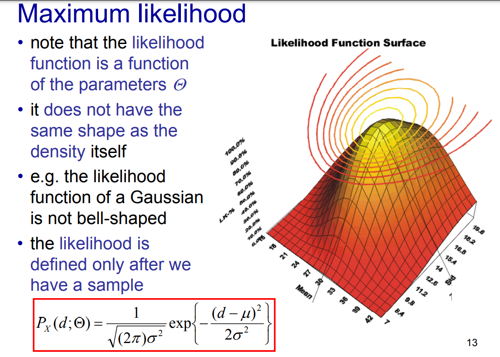

Although Probabilty & Statistics is tough to understand and wrap you head around but: **वो समझे भी क्या जो उलझा नहीं ।**

---

Let us say we transmit a signal $\theta$ and the receiver gets $y$ which is linear transformation $A$ of the signal plus some additive noise $n$. Now, since the signal gets corrupted due to noise, the receiver has to somehow estimate $\theta$ given the observation $y$. In this blog, we will look at different methods to estimate $\theta$ given $y$ and $A$. We will also look at the different assumptions we make about the noise $n$ and the signal $\theta$. The problem of parameter estimation is highly relevant in the field of deep learning, especially generative models.

## Classical Estimation

In classical (i.e., non-Bayesian) statistical parameter estimation, unknown parameters $\theta$ associated with (often even defining) a statistical model are assumed to be deterministic. To estimate a $\theta$, we assemble a collection of datasets $ D = {y_{0}, y_{1}, \dots y_n }$ set of examples drawn independently. The data is assumed to be generated by a probability distribution $P(y;\theta)$ and hence the data is a random variable.

Note that $\theta$ is NOT a random variable it is simply a parameter, and the probabilities are a function of this parameter. Before looking at the ways to find an estimator, let us look at a concept called likelihood function.

## Likelihood Function

The likelihood function is the joint probability of the data given the parameter. It is a function of the parameter $\theta$ and is defined as:

$$L(\theta | D) = P(D;\theta) = P(y_1, y_2, \dots, y_n;\theta)$$

The likelihood function measures the plausibility of a set of parameter values given specific observed data. Likelihood is not a PDF, which is evident since it does not integrate to 1 wrt to $\theta$. It is just a mesaure of how likely the data is given the parameter, and not the probability of the parameter given the data. Conviniently, the likelihood function is a function of probabilities of the data given the parameter.

Unlike probability, which treats the parameters as fixed and the data as variable, the likelihood function treats the data as fixed and the parameters as variable

Here $d$ is the data and the parameters are $\mu$ and $\sigma$

Also, the likelihood is an "after-sample" one, meaning it is only defined after we have a sample. Whereas, conditional density is a "pre-sample" concept. [Good explanation as to why likehood function is not a pdf.](https://stats.stackexchange.com/questions/31238/what-is-the-reason-that-a-likelihood-function-is-not-a-pdf)

## Estimator

Estimator $\hat{\theta}$ is a function of the random variables $Y$ and hence is a random variable itself. It is used to estimate the parameter $\theta$. For example, the sample mean is an estimator for the population mean. The sample mean is a random variable since it depends on the random variables $Y_1, Y_2, \dots, Y_n$.

$$\hat{\theta} = f(Y_1, \dots, Y_n)$$

An estimate is the value of the estimator for a given sample and hence not a random variable. Here $\hat{\theta}$ represents the estimator and not the estimate.

## Evaluating the estimator

Before we can come up with an estimator, we need a method to evaluate the estimator. A natural optimality criterion for estimators is the mean square error (“little mse”) which is the simplifies to the sum of the bias square and variance.

$$mse_\theta(\hat{\theta}) = E[\tilde{\theta}^T\tilde{\theta}]$$

$$mse_\theta(\hat{\theta}) = tr(Cov_\theta(\hat{\theta})) + Bias_\theta(\hat{\theta})^TBias_\theta(\hat{\theta})$$

$$Bias(\hat{\theta}) = E[\hat{\theta} - \theta]$$

$$Cov(\hat{\theta}) = E[(\hat{\theta} - E[\hat{\theta}])(\hat{\theta} - E[\hat{\theta}])^T]$$

where $\tilde{\theta} = \hat{\theta} - \theta$ is the error in the estimate.

Here all the calculations are done over the expectation operator $E$ over the distribution of the data $D$. This means that the expectation is taken over all the possible datasets that we can get.

### Big MSE

$$MSE_\theta(\hat{\theta}) = E[\tilde{\theta}\tilde{\theta}^T]$$

Note that $$mse_\theta(\hat{\theta}) = tr(MSE_\theta(\hat{\theta}))$$

For all unbiased estimators, we have:

$$MSE_\theta(\hat{\theta}) = Cov(\hat{\theta}) = Cov_\theta(\tilde{\theta})$$

Since the MSE is dependent on both bias and variance, to make the problem of finding an estimator with least MSE tractable, we impose the constraint that we will only search within the family of uniformly unbiased estimators known as uniformly minimum variance estimator. This implies that the criterion of estimator optimality is equal to minimum variance.

But keep in mind that sometimes, introducing a small bias can lead to a significant reduction in variance. In such cases, a biased estimator (which would be non-regular if the bias does not vanish as the sample size increases) can have a smaller mean square error (MSE) than any unbiased estimator.

### Uniformly Minimum Variance Unbiased Estimator

Let us look at a statistical family of distributions called regular. Regular Statistical Family means that the pdf of the observation is doubly differentiable with respect to the parameter and the input (support) of the pdf is not a function of the parameter. For example, a uniform distribution with support [0, $\theta$] is not a regular statistical family since the support is a function of the parameter $\theta$.

A sufficient (but not necessary) condition for an estimator of a parameter associated with a regular statistical family to be a uniformly minimum variance unbiased estimator (UMVUE) is that its variance uniformly attains the Cramer-Rao Lower Bound.

For unbiased estimator belonging to Regular Statistical Family, we can always find a lower bound on the $Cov_\theta(\hat{\theta})$ equal to CRLB.

An estimator which is unbiased and attains the CRLB is said to be efficient in that it efficiently uses the data. An estimator maybe UMVUE but not efficient, i.e. it may not attain the CRLB. This means that there is another estimator which is unbiased and has lower variance than the UMVUE.

Let us look at a few concepts which will help us in calculating the CRLB.

### Score

The score function is the derivative of the log-likelihood function with respect to the parameter. It can be interpreted as a measure of how "sensitive" the likelihood is to changes in the parameter.

$$s_\theta(y) = \frac{\partial}{\partial \theta} log(P(y;\theta))$$

If the family of distributions is regular (RSF), the expected value of the score function is zero.

$$E_\theta[s_\theta(y)] = 0$$

NB: Is is called score function because Fisher used it while studying genetics and named it such.

### Fisher Information Matrix

The Fisher information matrix is the Covariance matrix of the score function.

$$J_\theta = Cov_\theta(s_\theta(y)) =  E_\theta[s_\theta(y)s_\theta(y)^T] = -E_\theta[\frac{\partial^2}{\partial \theta^2} log(P(y;\theta))]$$

If FIM is positive definite, then $J_\theta^{-1}$ is the Cramer-Rao lower bound and $J_\theta^{-1} \leq Cov_\theta(\hat{\theta})$ $\forall$ unbiased estimators $\hat{\theta}$.

If $\tilde{\theta} = J_\theta^{-1}s_\theta(y)$, then $J_\theta^{-1} = Cov_\theta(\tilde{\theta}) = Cov_\theta(\hat{\theta})$ and the estimator $\hat{\theta}$ is the UMVUE.

### Jensen's Inequality

The following inequality is used in many of the proofs for the results in this blog which I have conveniently skipped. :)

Jensen's inequality states that if f is a convex function, ($x^2, log(x)$) and X is a random variable, then

$$E[f(X)] \geq f(E[X])$$

and if f is a concave function and X is a random variable, then

$$E[f(X)] \leq f(E[X])$$

The equality holds if and only if X is a constant.

## Estimation Methods

We now know how to evaluate an estimator but how do we get an estimator? Some of the methods include MLE, BLUE, MoM.

### Maximum Likelihood Estimation

The MLE approach is based on a heuristically reasonable inductive principle, but otherwise is not designed at the outset to result in estimators with any optimality properties. Thus the existence of such properties (if they do occur) can be viewed as important “happy accidents.”

We want to find a $\theta$ that maximizes the "likelihood" $L(\theta; D)$. Here $D$ is the observed data. In MLE, we find the $\theta$ that maximizes the probability of our observation. The ML estimate for $\theta$ is given by:

$$\theta^*= argmax_\theta L(\theta; D) $$

#### Linear Gaussian Model

Linear Gaussian model is a model where the data is linearly related to the parameters and the noise is Gaussian.

$y = A\theta + n$ where $n \sim N(0, C)$

Here both A and C are known. Coincidentally, the MLE for linear-Gaussian models is also the UMVUE.

### Linear Unbiased Estimators

Let us say we want to restrict our estimators to be linear functions of the data. What is the best linear estimator that we can get, i.e. the linear estimator with the least variance? Here again we assume the estimator to be unbiased.

Also keep in mind the assumption we made at the starting that our data as linear function of the parameters $y = A\theta + n$ plus some additive noise n.

Now if the noise $n$ is iid, has zero-mean and has uniform covariance C and not neccesarily Gaussian, we can use the Gauss (Markov) theorem to find the best linear unbiased estimator. (BLUE). Keep in mind that there might be better non linear estimators, but this theorem only deals with linear estimators.

We assume a linear unbiased estimator for the parameters i.e. $\hat{\theta} = Ky$ where K is a matrix and $E[\hat{\theta}] = \theta$.

#### Gauss (Markov) theorem

It states that the ordinary least squares (OLS) estimator has the lowest sampling variance within the class of linear unbiased estimators, if the errors in the linear regression model are uncorrelated, have equal variances and expectation value of zero, i.e. OLS is the Best Linear Unbiased Estimator (BLUE).

Ordinary Least Squares (OLS) refers to the method of estimating the parameters by minimizing the sum of the squared errors.

$$\hat{\theta} = \arg \min_{\theta} \lVert y - A\theta \rVert^2$$

Since $\theta = Ky$, we can write the OLS as:

$$K = \arg \min_{K} \lVert y - AKy \rVert^2$$

$$K = (A^TC^{-1}A)^{-1}A^TC^{-1} \implies \hat{\theta} = (A^TC^{-1}A)^{-1}A^TC^{-1}y$$

The Covariance of the estimator is $Cov(\hat{\theta}) = (A^TC^{-1}A)^{-1}$

This theorem is very powerful in the sense that it does not assume any distribution for the noise. It only assumes that the noise is uncorrelated, has zero mean and equal variance. This is a very weak assumption and hence the theorem is very general. Which means if you need to find the Best Linear Estimator for any distribution, just use OLS.

Incase the noise does not have a zero mean but is known, we can move the mean to the parameter $\theta$ and then use OLS.

Compare this with the five assumptions of the linear regression model, homoscedasticity, no auto-correlation, no multicollinearity, normality, and linearity. The Gauss Markov theorem only assumes the first three.

### Method of Moments

Moment is a measure of the shape of a probability distribution. The $k_{th}$ moment of a random variable X is defined as $E[Y^k]$. The first moment is the mean, the second moment is the variance and the third moment is the skewness.

The method of moments is based on the idea that the population moments can be estimated by the sample moments. The sample moments are the averages of the data.

We construct a vector $m(\theta) = [E[Y], E[Y^2], \dots, E[Y^k]]$ where $E[Y^k]$ is the $k^{th}$ moment of the distribution. We equate $m(\theta)$ with $\hat{m(y)}$

$$\hat{m}(y) = [\frac{1}{n}\sum_{i=1}^n y_i, \frac{1}{n}\sum_{i=1}^n y_i^2, \dots, \frac{1}{n}\sum_{i=1}^n y_i^k]$$ and solve for $\theta$.

The number of moments required to estimate the parameters depends on the number of parameters. For example, if we have a Gaussian distribution and we need to estimate the mean and variance, we need two moments. For a uniform distribution, we need to estimate the min and max, so we need two moments. Also, we only take the moments which are non zero. For example, for a uniform distribution $U(-\theta, \theta)$, the first moment is zero, so we use the second moment.

Similar to MLE, the MoM does not give any guarantees about the optimality of the estimator.

## Expectation-Maximization Algorithm

We saw a few methods to estimate the parameters given the complete data, but what if only partial data is observed? In that case, we can use the EM algorithm to estimate the parameters. The EM algorithm can also be used if the data is complete but the likelihood function is difficult to optimize.

Assume we have a set of observed data points $X$, and a set of latent or unobserved data points $Z$. The parameters of the model are denoted by $\theta$. We consider the log-likelihood function of the complete data (observed $X$ and latent $Z$), which we denote as $\log P(X, Z ; \theta)$.

If we knew Z, we could have simply use MLE and maximized log-likelihood function to get the parameters $\theta$. But since we don't know Z, we take all possible values of Z and maximize the weighted sum of the log-likelihood function. The weights are the probability of the Z given the observed data. This gives us the Q function.

The Expectation-Maximization (EM) algorithm is a method for finding maximum likelihood estimates of parameters in statistical models, where the model depends on unobserved latent variables. The EM algorithm alternates between performing an expectation (E) step, which creates a function for the expectation of the log-likelihood evaluated using the current estimate for the parameters, and a maximization (M) step, which computes parameters maximizing the expected log-likelihood found on the E step. These parameter-estimates are then used to determine the distribution of the latent variables in the next E step.

Let's break down the E step with a latent variable $Z$ in more detail:

### Expectation (E) Step

The E step involves calculating the expected value of the complete data log-likelihood with respect to the conditional distribution of $Z$ given $X$ and the current estimate of the parameters $\theta^{(t)}$. This can be mathematically expressed as:
$$Q(\theta ; \theta^{(t)}) = E_{Z|X;\theta^{(t)}}[\log p(X, Z ; \theta)]$$

The integral form of the Q function is given by:
$$Q(\theta;\theta^{(t)}) = \int \log P(X, Z ; \theta) p(Z|X ; \theta^{(t)})dZ$$

This expectation is the $Q$-function. It's called the expectation because we're computing the expected value of the log-likelihood over the distribution of the latent variables $Z$.
In practice, this integral is often intractable and cannot be solved analytically. Instead, we might use numerical integration, Monte Carlo integration, or other approximations to evaluate this integral. The integral form is more commonly applied in models where $Z$ represents a continuous latent variable, such as in certain Bayesian models or models with continuous latent spaces.

To compute this expectation, we need to know $p(Z|X, \theta^{(t)})$, which is the posterior distribution of the latent variables given the observed data and the current parameter estimates. This is often derived from Bayes' theorem.

The E step does not involve any optimization itself; it's purely about setting up the expectation for the complete-data log-likelihood, which will then be maximized in the M step with respect to $\theta$.

In the M-step of the EM algorithm, we aim to find the parameter values that maximize the Q function obtained in the E-step. The Q function represents the expected value of the complete data log-likelihood, where the expectation is taken with respect to the distribution of the latent variables given the observed data and the current parameter estimates.

### M-step

$$\theta^{(t+1)} = \arg \max_\theta Q(\theta|\theta^{(t)})$$

This means we want to find the parameter set $\theta$ that maximizes the Q function that was computed in the E-step. The form of the maximization will depend on the specific model being estimated and the functional form of the Q function.

In some cases, the maximization can be done analytically, leading to closed-form updates for the parameters. In other cases, the optimization may need to be performed numerically. The new parameter estimates $\theta^{(t+1)}$ are then used in the next iteration of the E-step, and the process repeats until convergence or another stopping criterion is met such as a maximum number of iterations.

## Bayesian Estimation

Until now, we assumed that the parameters to be estimated are deterministic and have no prior distribution. Now let us assume that we have some prior knowledge about the parameters to be estimated, is there a way to incorporate this knowledge into the estimation process? In Bayesian estimation, we assume that the parameters are random variables and have a known prior distribution.

The prior is the distribution of the parameters before we have collected any data while the posterior distribution is the calculated parameter distribution post-data collection. The posterior distribution is proportional to the product of the likelihood and the prior distribution.

$$P(\theta|D) = \frac{P(D|\theta)P(\theta)}{P(D)}$$

Here $P(\theta|D)$ is the posterior distribution, $P(D|\theta)$ is the likelihood, $P(\theta)$ is the prior distribution and $P(D)$ is the evidence.

This is based on the Bayes theorem. For a more detailed explanation of the Bayes theorem, check [here]().

Two simple ways to find a point estimate for $\theta$ are first, we can take the value of $\theta$ that maximizes the probabilty of seeing the data while incoporating the prior distribution of the parameters. (posterior distribution) i.e. $\theta_{MAP} = \arg \max_\theta P(\theta|D)$.

Second, instead of taking the max value, we can calculate the expected value of $\theta$ given the parameters i.e.

$$\theta_{MMSE} = E[\theta | D] = \int \theta P(\theta|D) d\theta$$

The first method is called the Minimum Mean Squared Error (MMSE) estimator and the second method is called the Maximum A Posteriori (MAP) estimator.

We can take the example of a basket of apples each with a different weight. We want to estimate the mean weight of the apples using a weight scale. But the scale is noisy and gives us a noisy estimate of the weight. This gives us the model:

$$y = w + n$$

Here $y$ is the noisy estimate of the weight, $w$ is the true weight and $n = N(0, \sigma^2)$ is the noise. We can model the true weight as a random variable with a prior distribution $p(w) = N(\mu, \sigma_0^2)$.

### Evaluating Bayesian estimator

While dealing with bayesian statistics, along with the data, the parameters to be estimated are also random variables. Therefore, the expectation of the loss function is taken over the distribution of both the parameters and the data. The bayesian loss function $L(\theta, \hat{\theta})$ is given by:

$$L(\theta, \hat{\theta}) = E_{\theta, D}[L(\theta, \hat{\theta})] = \int \int L(\theta, \hat{\theta})P(\theta, D)d\theta dD$$

$$L(\theta, \hat{\theta}) = \int L(\hat{\theta} | D)P(D)dD = \int L(\hat{\theta} | \theta)P(\theta)d\theta$$

Since $P(D)$ and $P(\theta)$ are both positive, we can minimize the loss function by just minimizing the conditional loss function $L(\hat{\theta} | \theta)$ or $L(\hat{\theta} | D)$. If we can minimize $L(\hat{\theta} | D)$ for all values of D, we can minimize the loss function.

$$\hat{\theta_*}(D) = \arg \min_{\hat{\theta}} L(\hat{\theta}) = \arg \min_{\hat{\theta}} L(\hat{\theta} | D)$$

## Minimum Mean Squared Error Estimator

Let us take the case of squared loss function $L(\theta, \hat{\theta}) = \lVert \theta - \hat{\theta} \rVert^2$. The expected loss is given by:

$$L(\theta, \hat{\theta}) = \int \int \lVert \theta - \hat{\theta} \rVert^2 P(\theta, D) d\theta dD$$

To get the estimator which minimizes the loss, we take the gradient of the loss function with respect to $\hat{\theta}$ and equate it to zero, giving us the Minimum Mean Squared Error (MMSE) estimator.

$$\hat{\theta_*}(D) = \hat{\theta}_{MMSE}(D) = E[\theta|D] = \int \theta P(\theta|D) d\theta$$

This gives us an estimator for a particular value of D which takes into account the prior distribution of the parameters.

### Maximum A Posteriori Estimatior

Let us say we want to get a point estimate of a parameter $\theta$ which has a prior distribution $P(\theta)$. A good point estimate for the parameter would just be $E(\theta)$. If we are not confident in our prior we can collect some data $D$ and improve our estimate. This gives us a new posterior distribution of the parameter $P(\theta | D)$.

The new "best" estimate is the $\theta$ that maximizes this posterior. We call it as the Maximum A Posteriori (MAP) estimate. It is also the mode of the posterior distribution

$$\theta_{MAP} = \arg \max_\theta P(\theta|D) = \arg \max_\theta P(D|\theta)P(\theta)$$

We can also derive the above result by minimizing the bayes loss. In the case of MMSE, we took our loss function to be the squared loss function. But what if we take the loss function to be the Hit or Miss loss function, i.e. $L(\theta, \hat{\theta}) = 1$ if $\theta \neq \hat{\theta}$ and $L(\theta, \hat{\theta}) = 0$ if $\theta = \hat{\theta}$. This gives us the Maximum A Posteriori (MAP) estimator.

#### Maximum Likelihood Estimation vs Maximum A Posteriori Estimation

MLE is a special case of MAP where the prior distribution is uniform. A good blog explaining the difference is [here](http://www.bdhammel.com/mle-map/).

If $P(\theta)$ is uniform, then MAP becomes:

$$ \theta*{MAP} = \arg \max*\theta P(D|\theta)P(\theta) = \arg \max*\theta P(D|\theta) = \theta*{MLE}$$

## LMMSE Estimator

Let us again assume we have $y = A\theta + n$ where we don't know the distribution of $n$ or $\theta$ however we know $E[n] = m_n$, the covariance matrix $C_n$, mean $m_\theta$ and covariance matrix $C_\theta$.
Despite not knowing the distributions, we can find the best linear estimator that attains the least mean squared error (MSE) for a parameter $\theta$ given the observation $y$.

$$\hat{\theta_{LMMSE}} = m_\theta + C_{\theta y}C_{yy}^{-1}(y - m_y)$$

If $y = A\theta + n$ where $n \sim N(\mu_n, \Sigma_n)$ and $\theta \sim N(\mu_\theta, \Sigma_\theta)$, then the LMMSE estimator is given by:

$$\hat{\theta_{LMMSE}} = \mu_\theta + \Sigma_\theta A^T(A\Sigma_\theta A^T + \Sigma_n)^{-1}(y - A\mu_\theta + \mu_n)$$

Here $C_{\theta y} = \Sigma_\theta A^T$ and $C_{yy} = A\Sigma_\theta A^T + \Sigma_n$.

If $\theta$ and $y$ are jointly gaussian, the LMMSE estimator is the same as the MMSE estimator.

## Sequential Bayesian Estimation

Let us say we have a stream of states $x_1, x_2, \dots, x_n$ and measurements $y_1, y_2, \dots, y_n$ and we want to estimate the state $x_n$ given the measurements $y_1, y_2, \dots, y_n$ and the previous states $x_1, x_2, \dots, x_{n-1}$.

We construct a model for the state transition $x_n = g(x_{n-1}) + u_{n-1}$ where $u_{n}$ is the driving noise. We also construct a model for the measurement $y_n = h(x_n) + v_n$ where $v_n$ is the noise in the measurement. We assume that the noise is Gaussian with zero mean and covariance matrix $\Sigma_u$ and $\Sigma_v$ respectively.

Mathematically expressed by “Markovian properties”:

$$P(x_n | x_{n-1}, x_{n-2}, \dots, x_1, y_{n-1}, \dots, y_1) = P(x_n | x_{n-1})$$

$$P(y_n | x_n, x_{n-1}, \dots, x_1, y_{n-1}, \dots, y_1) = P(y_n | x_n)$$

Comparing it with above, here $D = \{y_1, y_2, \dots, y_{n}\}$ and $\theta = x_{n}$, therefore the MMSE estimator is given by:

$$\hat{x_n} = E[x_n | y_1, y_2, \dots, y_{n}] = \int x_n P(x_n | y_{1:n}) dx_n$$

Unlike previous cases, calculating the posterior distribution $P(x_n | y_{1:n})$ is not straight forward since we now have the measurement and motion model. We calculate the posterior in two steps i.e. prediction and update steps.

### Prediction Step

Prediction refers to estimating the next position $x_n$ in the sequence, given the measurements $y_1, y_2, \dots, y_{n-1}$ or or $P(x_n | y_{1:n-1})$ and the state transition model $x_n = g(x_{n-1}) + u_{n-1}$ or $P(x_n | x_{n-1})$.

We find $P(x_n | y_{1:n-1})$ by marginalizing over $x_{n-1}$

$$P(x_n | y_{1:n-1}) = \int P(x_n , x_{n-1} | y_{1:n-1}) dx_{n-1}$$

Next we use chain rule of probability,

$$P(x_n | y_{1:n-1}) = \int P(x_n | x_{n-1}, y_{1:n-1}) P(x_{n-1} | y_{1:n-1}) dx_{n-1}$$

Finally we use the markovian property,

$$P(x_n | y_{1:n-1}) = \int P(x_n | x_{n-1}) P(x_{n-1} | y_{1:n-1}) dx_{n-1}$$

We have expressed $P(x_n | y_{1:n-1})$ in terms of $P(x_{n-1} | y_{1:n-1})$, but we still need to find $P(x_{n-1} | y_{1:n-1})$. We can do this by using the update step recursively.

### Update Step

Next, we also incorporate the measurement $y_n$ into our estimate. We can do this by using the measurement model $y_n = h(x_n) + v_n$ and the predicted state $\hat{x}_{n | {n-1}}$

$$P(x_n | y_{1:n}) = \frac{P(y_n | x_n) P(x_n | y_{1:n-1})}{P(y_n | y_{1:n-1})}$$

Our initial assumption was that we are dealing with a linear model of the parameters and additive noise. This helps us simplify the above equation and gives us a closed form solution for the MMSE estimator.

## Kalman Filter

If the state transition model and the measurement model are linear and the noise is zero mean Gaussian and the prior is gaussian, we can use the Kalman filter to get a closed form solution for the MMSE estimator.

Linear-Gaussian state space model:

$$x_n = G_{n}x_{n-1} + u_{n}$$

Linear-Gaussian measurement model:

$$y_n = H_{n}x_{n} + v_{n}$$

Here $u_n$ and $v_n$ are the driving and measurement white noise respectively. They are both Gaussian with zero mean and covariance matrix $\Sigma_u$ and $\Sigma_v$ respectively.

### Kalman Prediction Step

<!-- $$f(x_n | y_{1:n-1}) = \int f(x_n | x_{n-1}) f(x_{n-1} | y_{1:n-1}) dx_{n-1}$$

$f(x_n | y_{1:n-1})$ is a gaussian distribution with mean $ \mu_{x} = G_{n}\hat{x}_{n-1}$ and covariance $G_{n}\Sigma_x_{n-1}G_{n}^T + \Sigma_u$ -->

$$x_{n | n-1} = G_{n}x_{n-1}$$

$$\Sigma_{x_{n | n-1}} = G_{n}\Sigma_{x_{n-1}}G_{n}^T + \Sigma_u$$

$x_{n | n-1}$ is sometimes also written as $x_{n}^{-}$ and $\Sigma_{x_{n | n-1}}$ is also written as $\Sigma_{x_{n}}^{-}$

### Kalman Update Step

$$x_{n} = x_{n | n-1} + K_{n}(y_n - H_{n}x_{n | n-1})$$

$$\Sigma_{x_{n}} = (I - K_{n}H_{n})\Sigma_{x_{n | n-1}}$$

$$K_{n} = \Sigma_{x_{n | n-1}}H_{n}^T(H_{n}\Sigma_{x_{n | n-1}}H_{n}^T + \Sigma_v)^{-1}$$

<!--
Combining the prediction, update steps and Kalman gain we get,

$$x_n = G_{n}x_{n-1} + (G_{n}\Sigma_{x_{n-1}}G_{n}^T + \Sigma_u)H_{n}^T(H_{n}(G_{n}\Sigma_{x_{n-1}}G_{n}^T + \Sigma_u)H_{n}^T + \Sigma_v)^{-1}(y_n - H_{n}G_{n}x_{n-1})$$

Opening all the brackets and simplifying we get,

$$x_n = (G_{n}^T\Sigma_u^{-1}G_{n} + H_{n}^T\Sigma_v^{-1}H_{n})^{-1}(G_{n}^T\Sigma_u^{-1}G_{n}x_{n-1} + H_{n}^T\Sigma_v^{-1}y_n)$$ -->

Here $K_n$ is known as the Kalman gain. Also, note that the Kalman gain and the covariance matrix are independent of the measurement $y_n$ and hence can be precomputed for all values of $n$.

For LMMSE estimate, we only need the mean and covariance matrices regardless of the distribution of the noise or the prior. Similarly for Kalman filter, Kalman filter gives us the best LMMSE estimate regardless of the distribution, if we know the mean and covariance matrices.

## Extended Kalman Filter

Uptil now our obersevation model is linear function of the parameters plus some additive noise. We didn't have to explore the non-linear case since we can always take the function of the parameter as the new parameter. For example, if we have $y = \theta^2 + n$, we can take $z = \theta^2$ and estimate $\theta$ using $z$.

But in the case of Sequential Bayesian Estimation that has both state transition model and measurement models, we need to estimate the actual parameters and not just a function of the parameters. One of the ways to solve the non linear case is to again use the Kalman filter but since it assumes both the models to be linear we have to linearize the models.

We linearize the models around the mean using a First order Taylor linear approximation giving us the Extended Kalman Filter.

### Extended Kalman Prediction Step

$$\tilde{\mu_{n | n-1}} = g(\tilde{\mu_{n-1}})$$

$$\tilde{\Sigma_{\mu_{n | n-1}}} = G_{n}\tilde{\Sigma_{\mu_{n-1}}}G_{n}^T + \Sigma_{u_n}$$

Here $G_{n}$ is the Jacobian of the function $g$ evaluated at $\tilde{\mu_{n-1}}$.

~ represents the fact that the mean and covariance are approximations and not the actual values.

### Extended Kalman Update Step

$$\tilde{\mu_{n}} = \tilde{\mu_{n | n-1}} + K_{n}(y_n - h(\tilde{\mu_{n | n-1}}))$$

$$\tilde{\Sigma_{\mu_{n}}} = (I - K_{n}H_{n})\tilde{\Sigma_{\mu_{n | n-1}}}$$

$$K_{n} = \tilde{\Sigma_{\mu_{n | n-1}}}H_{n}^T(H_{n}\tilde{\Sigma_{\mu_{n | n-1}}}H_{n}^T + \Sigma_{v_n})^{-1}$$

Here $H_{n}$ is the Jacobian of the function $h$ evaluated at $\tilde{\mu_{n | n-1}}$.

Also, since $H_{n}$ is a function of $\tilde{\mu_{n | n-1}}$, we cannot precompute it like the Kalman gain.
