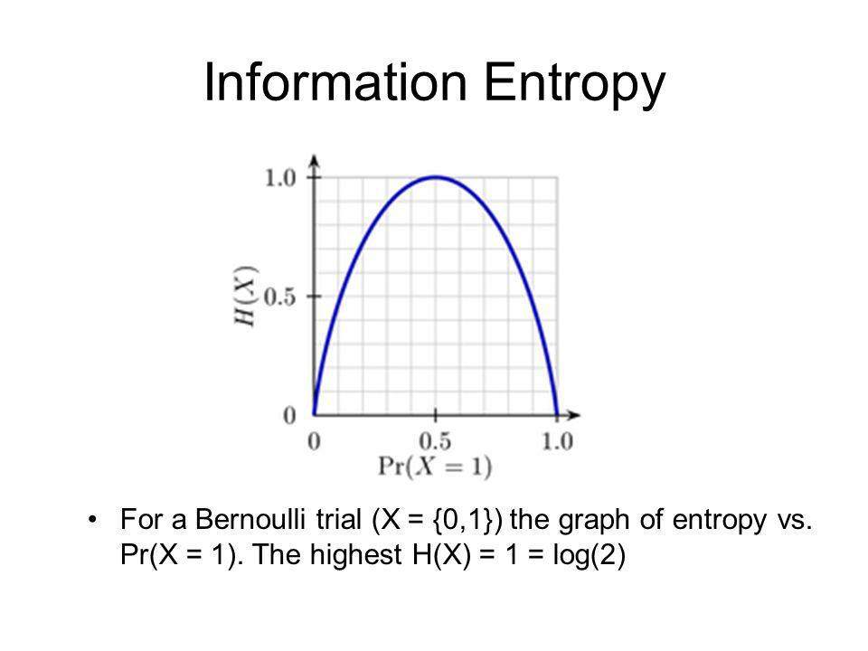
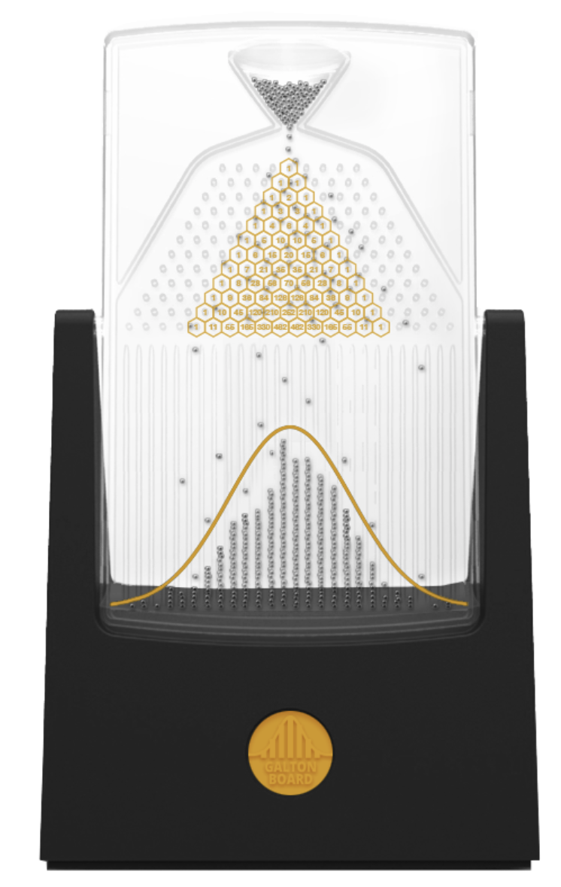
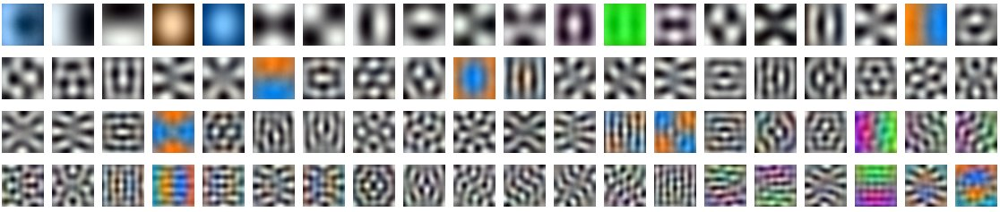

Let us have a look at some of the important concepts in Probability and Statistics that are used in Machine Learning. The order of the topics is not important and the topics are not exhaustive.

---

## Markov Chain

A Markov chain is a stochastic model describing a sequence of possible events in which the probability of each event depends only on the state attained in the previous event. In other words, it is a memoryless sequence of random variables $X_1, X_2, \dots$ with the Markov property. The Markov property says that the probability of moving to the next state depends only on the current state and not on the previous states.

Let us say we have a directed connected graph with nodes as the states and edges as the transition probabilities. The transition probabilities are the probabilities of moving from one state to another. 

One of the useful concepts in Markov chain is the stationary distribution. The stationary distribution is the distribution of the states after the chain has been run for a long time, i.e. the probability of being in a state after the chain has been run for a long time. The stationary distribution is the eigenvector of the transition matrix with eigenvalue 1.

But why is the stationary distribution important? One of its use cases is in the MCMC algorithms. 

## Entropy

We can say that the amount information we get when an event happens is equal to $\frac{1}{p(event)}$. For example if I say sun rose form the East, the info you get is 1 but if I say the opposite, you get infinite information since its not possible. We can take the log base 2 of information to get the number of bits required to transfer the information.

Information($I$) = $-log(p(x))$

For a coin toss, $p(H) = p(T) = 0.5 \implies I = 1$, which should be the case since we need 1 bit to tell whether we landed heads or tails. If the probability of an event is high, the information we get is low, and vice versa.

$Entropy(H)$ refers to the expected value of information/surprise or the minimum number of bits required to transfer information on average.

$$H = -\sum p(x)log(p(x))$$

For a binary random variable, $H = -(p log(p) + (1-p)log(p))$. The max value occurs when $p(H) = 0.5$, i.e. when we use a fair coin. This implies that on average we need 1 bit to tell the result of a fair coin toss.

For a biased coin, if $p(H) = 0.9$, we are almost sure that the result of toss will be heads, therefore less number of bits are required to transfer the result of toss. (if somehow we can transfer fractional bits This is okay since it's a mathematical concept and it need not have a physical counterpart)

### Cross Entropy

$$H(p,q) = -E_p[log(q(x))]$$

is the cross-entropy of the distribution q relative to a distribution p. In information theory, the cross-entropy between two probability distributions p and q over the same underlying set of events measures the average number of bits needed to identify an event drawn from the set if a coding scheme used for the set is optimized for an estimated probability distribution q, rather than the true distribution p.

For discrete distributions,

$$H(p,q) =  -\sum p(x)log(q(x))$$

## Bayes Rule intuition

Your roommate, who's a bit of a slacker, is trying to convince you that money can't buy happiness, citing a Harvard study showing that only 10% of happy people are rich. After giving it some thought, it occurs to you that this statistic isn't very compelling. What you really want to know is what percent of rich people are happy. This would give a better idea of whether becoming rich might make you happy.

Bayes' Theorem tells you how to calculate this other, reversed statistic using two additional pieces of information, the percent of people overall who are happy and the percent of people overall who are rich. The key idea of Bayes' theorem is reversing the statistic using the overall rates. It says that the fraction of rich people who are happy is the fraction of happy people who are rich, times the overall fraction who are happy, divided by the overall fraction who are rich.

So if, 40% of people are happy; and 5% of people are rich and if the Harvard study is correct, then the fraction of rich people who are happy are:

$$P(happy|rich) = \frac{P(rich|happy)P(happy)}{P(rich)} = \frac{0.1 \times 0.4}{0.05} = 0.8$$

So a pretty strong majority of rich people are happy. It's not hard to see why this arithmetic works out if we just plug in some specific numbers. Let's say the population of the whole world is 1000, just to keep it easy. Then fact 1 tells us there are 400 happy people, and the Harvard study tells us that 40 of these people are rich. So there are 40 people who are both rich and happy. According to Fact 2, there are 50 rich people altogether, so the fraction of them who are happy is 40/50, or 80%.

### Recommended readings for Prior & Posterior

- <https://www.youtube.com/watch?v=Pahyv9i_X2k>
- <https://www.youtube.com/watch?v=HZGCoVF3YvM>
- <https://www.youtube.com/watch?v=R13BD8qKeTg>

## Naive Bayes

It's one of the simplest algorithm for classification but effective in many cases. It is based on Bayes theorem of conditional probability. It assumes that the features are independent of each other given the class. This is a strong assumption and hence the name naive.

$$P(y|x_1, x_2, \dots, x_n) = \frac{P(y)P(x_1, x_2, \dots, x_n|y)}{P(x_1, x_2, \dots, x_n)}$$

$$P(x_1, x_2, \dots, x_n|y) = P(x_1|y)P(x_2|y) \dots P(x_n|y)$$

$$P(x_1, x_2, \dots, x_n) = \sum_{y} P(y)P(x_1, x_2, \dots, x_n|y)$$

Let us take the example of classifying mail as spam vs not spam. We have 2 features, $y_1, y_2$ and 2 classes, spam and not spam. The features $x_1, x_2, \dots, x_n$ are the words in the mail. The naive assumption is that the words are independent of each other given the class. $P(x_1 | y)$ is simply the probability of the word $x_1$ appearing in the class $y$. $P(y)$ is the prior probability of the class $y$ which is basically the ratio of the class to the total number of mails, $P(y) = \frac{N_y}{N}$.

## Central Limit Theorem vs Law of Large numbers

The Law of Large Numbers basically tells us that if we take a sample (n) observations of our random variable and avg the observation(mean) it will approach the expected value E(x) of the random variable i.e. the population mean.

On the other hand, the Central Limit Theorem tells us a procedure. First we sample from a distribution k times and take its mean. If we repeat the process n times, we get a normal distribution and as n increases $\to \infin$, we find a normal distribution. For a good approximation, k > 30.

Central Limit theorm can also be thought of repeated convolution of the distribution of the random variable with itself. As the number of convolution increases, the distribution approaches a normal distribution. A good explanation is the 3Blue1Brown [video](https://www.youtube.com/watch?v=zeJD6dqJ5lo).

Lets the the example of a Galton Board. Each row of pegs is like a binary distribution that can take value +1 and -1 with equal probability. The sum of the values of the pegs in a column is the random variable. Here k is the number of rows, and as we increase the the number of balls, the distribution of the sum of the values approaches a normal distribution.

<!--  -->



Sum of random varables is equivalent to convolution opertation and convolution operation increases the entropy of the distribution. So as we increase the number of random variables, the entropy of the distribution increases and since the distribution with maximum entropy with fixes mean and variance is normal, we approach the normal distribution.

## Sampling

To sample from a distribution we need to know the CDF of the distribution. More precisely one needs the Inverse CDF i.e. a function that will give you the a sample if you feed it a probability. We can first sample from a uniform distribution and then use the inverse CDF to get the sample from the distribution we want. 

Although all CDFs are monotonically increasing and hence theoretically invertible, analytically (practically) calculating the CDF or even inverting it may not be straight forward. The problem gets more complex in higher dimensions. Therefore, we need efficient sampling techniques that can used to approximate the functions.

Let us look at few of the sampling techniques.

<!-- ### Importance sampling

- To do

### Rejection Sampling

- To do -->

### Metropolis-Hastings Algorithm

I recommend these [blog 1](https://blog.djnavarro.net/posts/2023-04-12_metropolis-hastings/#fn5) [blog 2](https://boyangzhao.github.io/posts/mcmc-bayesian-inference) for an in depth explanation with example.

It is one of the most popular MCMC algorithm. Let us say we have a distribution 
$$p(x) = \frac{f(x)}{Z}$$ where $f(x)$ is known function and $Z$ is the normalizing constant which is difficult to calculate. $f(x)$ for example, can be an energy function for Energy Based Models. The normalizing constant $Z$ is the integral of the function over the domain which can be difficult to calculate. This is also very common in Bayesian statistics where the norm const is the marginal likelihood. 

To sample form $p(x)$, we use a proposal distribution $q(x)$ which is easy to sample from. Usually, $q(x)$ is a Gaussian distribution.

The algorithm is as follows:

- Start with an initial value of the random variable.
- Sample a value from the proposal distribution $q(x)$.
- Calculate the acceptance probability $$A = min(1, \frac{p(x')q(x|x')}{p(x)q(x'|x)})$$ where $x'$ is the sample from the proposal distribution.

Usually, for gaussian the given value is taken as the mean of the gaussian. For a Gaussian distribution, $q(x|x') = q(x'|x)$ and the acceptance probability becomes $A = min(1, \frac{p(x')}{p(x)})$. This is the Metropolis algorithm. 

- Accept the sample with probability A.
- Repeat the above steps.

The algorithm is guaranteed to converge to the true distribution if the proposal distribution is sampled correctly.

Having an algoritm that can sample from any function is nothing short of amazing in my opinion. 

### Gibbs Sampling

I recommend this [blog](https://boyangzhao.github.io/posts/mcmc-gibbs-sampling-multivariate) for an in depth explanation with example.

Let us say we have a multivariate distribution $p(x_1, x_2, \dots, x_n)$ but sampling from the joint distribution is difficult. If we can easily sample from the marginal distributions $p(x_i|x_1, x_2, \dots, x_{i-1}, x_{i+1}, \dots, x_n)$, we can use the Gibbs sampling algorithm to sample from the joint distribution.

This is also a type of MCMC algorithm and a special case of Metropolis-Hastings algorithm with the acceptance ratio always being 1. Is is generally used for sampling from a multivariate distribution.

The algorithm is as follows:

- Start with an initial value of the random variables.
- Randomly select a random variable and sample from its conditional distribution given the current values of the other random variables.
- Repeat the above step for all the random variables.

The algorithm is guaranteed to converge to the true distribution if the conditional distributions are sampled correctly.

### Accept Reject Sampling [Video Explanation](https://www.youtube.com/watch?v=OXDqjdVVePY)

- Sample from a difficult to sample distribution $p(x) = f(x)/(norm const)$ where $f(x)$ is know but norm const is difficult to calculate due to integral. We use a easy to sample distribution $q(x)$, for eg. Gaussian with same domain as $p(x)$. $q(x)$ is such that Mq(x) >= p(x) for all $x$, where M is any positive number.

- Accept the sample form q(x) with prob. $\frac{f(x)}{Mq(x)}$

- Sampled values have the same distribution as if sampled from p(x).

- The main problem is to select M as small as possible or else we keep rejecting all samples as per $f(x)/(Mq(x))$

### Monte Carlo methods [Video Explanation](https://www.youtube.com/watch?v=EaR3C4e600k)

Monte Carlo methods are a broad class of computational algorithms that rely on repeated random sampling to obtain numerical results. For example, to get the value of $\pi$ by selecting random points in a square(with side length = 2) with a circle incribed inside it.

$$\frac{\text{area of circle}}{\text{area of square}} = \frac{\pi r^2}{4r^2} = \frac{\pi}{4}$$

It was names such due to a code name required for the MC equation obtained by scientists working on nuclear weapons at Los Alamos Lab. One of the scientist uncle took money from him to gamble at Monte Carlo casino in Monaco. Monte Carlo can also be used to prove the Monty Hall problem.

## Sample mean & variance 

Let us say we have a sample $x_1, x_2, \dots, x_n$ and we want to estimate the mean and variance of the population from which the sample was drawn. Now if the population size is very large, we can't take the mean of the entire population. So we use a sample to estimate the mean and variance of the population given by the formula:

$$\bar{x} = \frac{1}{n}\sum_{i=1}^n x_i$$

$$\sigma^2 = \frac{1}{n}\sum_{i=1}^n (x_i - \bar{x})^2$$

where $\bar{x}$ is the sample mean and $\sigma^2$ is the sample variance. 

The sample mean is an unbiased estimator of the population mean i.e.

$$E(\bar{x}) = \mu$$

where $\mu$ is the population mean. However, the sample variance has a bias equal to $\sigma^2(1 - \frac{1}{n})$. To correct for the bias of the variance, we can use $1/(n-1)$ instead of $1/n$ in the formula for the variance, giving us the formula for the sample variance as:

$$\sigma^2 = \frac{1}{n-1}\sum_{i=1}^n (x_i - \bar{x})^2$$

Now the sample variance is an unbiased estimator of the population variance i.e.

$$E(\sigma^2) = \sigma^2$$

This is called Bessel's correction.

One other perspective is that the variance is calculated between multiple terms, so if we only have 1 data point, calculating variance makes little sense. 

Also, after calculating the mean, we are left with n-1 degrees of freedom since we can get the $x_n$ from $\bar{x}$ and the other $n-1$ terms. Using $1/(n-1)$ instead of $1/n$ takes into account the reduction in degrees of freedom.

Good video explanation can be found [here](https://www.youtube.com/watch?v=fs4eg1u7oY)

<!-- 
## Hypothesis Testing

The difference between z and t has nothing to do with the sample size. It has everything to do with whether or not you are using a known population standard deviation or whether you are estimating it by using the standard deviation calculated from the sample.

IF YOU ARE USING A SAMPLE STANDARD DEVIATION TO CALCULATE THE STANDARD ERROR (estimate of standard deviation of the sampling distribution), THEN YOU USE A T-STATISTIC, REGARDLESS OF SAMPLE SIZE.

The reason for using t is to correct for the extra variability that is added when using an estimate from a sample rather than a known population parameter. Yes, as the sample sizes get large there is very little difference between the values of z and t, so a z table could be used as a good approximation. But we use computers now so the correct test to choose would be a t-test. (I know this has been taught incorrectly for years, but that is no reason to continue to do so) -->

## Assumptions of Linear Regression

Let us say we have some data $X$ and we want to fit a line $Y =  XM + \epsilon$ so as to estimate the parameters $M$ such that the sum of the squared error is minimum. Here the noise $\epsilon$ has a mean $\mu$ and variance-covaariance matrix $\Sigma$. Here, $Y$ is $n \times 1$ and $X$ is $n \times m$. Here $M$ is $m \times 1$. $n$ is the number of data points and $m$ is the number of features.

The solution to the above problem is given by $M = (X^T X)^{-1} X^T Y$. This may seem as a simple problem but the assumptions behind it are not.

The assumptions are as follows:

- Linear Relationship: Relationship between the independent and dependent variables are assumed to be linear, or else you won't be using linear regression. ($Y$ can't be a function of $x^2$). Simply, $Y$ is a linear combination of $X$ and $M$.

- No Multicollinearity: Independent variables (columns of $X$) are independent/uncorrelated with each other.

- Homoscedasticity: The variance of the residuals is constant. Here residual is the error i.e. the difference between the actual value and the predicted value. This simply means that the diagonal elements of the noise matrix $\Sigma$ are equal.

- No auto-correlation: auto-correlation is observed when the residuals are dependent on each other. Simply, the off-diagonal elements of the noise matrix $\Sigma$ are zero.

- Multi-variate normality: The residuals are normally distributed which means that the noise matrix $\Sigma$ is a normal distribution.

## Perfect Loss is all you need

A good loss function is highly essential in Deep Learning since all the optimizations is dependent on the gradients of the loss function. It should be able to capture the essence of the problem.

Since in ML, we deal with probability distributions let us look at some of the ways to measure the distance between two probability distributions.

### KL Divergence

KL Divergence is a measure of how one probability distribution is different from another. It is not a metric since it is not symmetric. It is also not a distance since it does not satisfy the triangle inequality. It is also not a norm since it is not sub-additive.

$$D_{KL}(P||Q) = \sum_{x \in X} P(x)log(\frac{P(x)}{Q(x)})$$

$$D_{KL}(P||Q) = E_{x \sim P}[log(\frac{P(x)}{Q(x)})]$$

$$D_{KL}(P||Q) = -H(P) - E_{x \sim P}[log(Q(x))]$$

$$D_{KL}(P||Q) = -H(P,Q) + H(P)$$

$$D_{KL}(P||Q) \geq 0$$

Here $H(P,Q)$ is the cross entropy between P and Q and $H(P)$ is the entropy of P.

<!-- Incase of VAE, we use reverse KL divergence instead of forward since  -->

### Jensen Shannon Divergence

Jensen Shannon Divergence is a symmetrized and smoothed version of KL Divergence. It is a metric and a norm.

$$JSD(P||Q) = \frac{1}{2}D_{KL}(P||M) + \frac{1}{2}D_{KL}(Q||M)$$

where $M = \frac{P+Q}{2}$

### Wasserstein Distance (Earth Mover Distance)

Wasserstein Distance is a metric and a norm. It is also known as Earth Mover Distance since it can be thought of as the minimum amount of work required to transform one distribution to another. It is also known as Kantorovich-Rubinstein distance.

$$W(P||Q) = \inf_{\gamma \in \Gamma(P,Q)} E_{(x,y) \sim \gamma}[\|x-y\|]$$

where $\Gamma(P,Q)$ is the set of all joint distributions $\gamma(x,y)$ whose marginals are P and Q respectively.

A simplified version of the above equation is:

$$W(P||Q) = \sup_{|f_L| \leq 1} E_{x \sim P}[f(x)] - E_{x \sim Q}[f(x)]$$

where $|f|_L \leq 1$ is the set of all 1-Lipschitz functions.

### Drawbacks and Advantages of the above metrics

A drawback with JSD is that if the two distributions are far apart, the value of JSD flattens out to log(2).

## Vector Calculus

In ML, vectors are usually represented as column vectors. So if we have a vector $x = [x_1, x_2, \dots, x_n]^T$, then $x^T = [x_1, x_2, \dots, x_n]$.

Giving physical interpretation to mathematical concepts helps in understanding them better, but as we go to higher dimensions, it becomes difficult to visualize them. Let us try to understand some of calculus concepts in higher dimensions.

### Derivative

Derivative of a function $f(x)$ is the rate of change of the function with respect to the variable $x$. It is also the slope of the tangent to the function at a point. It is also the best linear approximation of the function at a point.

$$f'(x) = \lim_{h \to 0} \frac{f(x+h) - f(x)}{h}$$

### Gradient

If the function $f(x)$ is only a function of one variable, then its derivative gives us the slope of the tangent to the function at a point. But let us consider $f(x, y) = x^2 + y^2$. Here the derivative of the function with respect to $x$ gives us the slope of the tangent to the function at a point in the $x$ direction and similarly for $y$. But since we are in 2D, we can move in any direction in the $xy$ plane. So what does derivative mean in this case? It is the direction of the steepest ascent of the function at a point. This is called the gradient of the function.

Gradient of a function $f(x)$ is the vector of partial derivatives of the function with respect to each of the variables. It is the direction of the steepest ascent of the function at a point. It is represented by the symbol $\nabla$.

$$\nabla f(x) = \begin{bmatrix} \frac{\partial f}{\partial x_1} \\\ \frac{\partial f}{\partial x_2} \\\ \vdots \\\ \frac{\partial f}{\partial x_n} \end{bmatrix}$$

### Jacobian

Uptil now, we were dealing with scalar valued functions, but what if out function has a vector output $f(x) = [f_1(x), f_2(x), \dots, f_m(x)]$. How do we find the derivative of such a function? We can find the derivative of each of the functions $f_1(x), f_2(x), \dots, f_m(x)$ and stack them together to get the Jacobian of the function.

Jacobian of a function $f(x)$ is the matrix of partial derivatives of the function with respect to each of the variables. It is the generalization of the gradient to higher dimensions. More formally, the Jacobian matrix of a vector-valued function of several variables is the matrix of all its first-order partial derivatives.

$$J_f(x) = \begin{bmatrix} \frac{\partial f_1}{\partial x_1} & \frac{\partial f_1}{\partial x_2} & \dots & \frac{\partial f_1}{\partial x_n} \\\ \frac{\partial f_2}{\partial x_1} & \frac{\partial f_2}{\partial x_2} & \dots & \frac{\partial f_2}{\partial x_n} \\\ \vdots & \vdots & \ddots & \vdots \\\ \frac{\partial f_m}{\partial x_1} & \frac{\partial f_m}{\partial x_2} & \dots & \frac{\partial f_m}{\partial x_n} \end{bmatrix}$$

For a physcial interpretation, we can think of the Jacobian as the best linear approximation of the function at a point.

We went from 0 dim (derivative) to 1 dim (gradient) to 2 dim (Jacobian). We can keep on generalizing to higher dimensions.

### Hessian

Hessian of a function $f(x)$ is the matrix of second order partial derivatives of the function with respect to each of the variables. It can be generalized to higher dimensions in case for vector valued functions.

$$\begin{bmatrix} \frac{\partial^2 f}{\partial x_1^2} & \frac{\partial^2 f}{\partial x_1 \partial x_2} & \dots & \frac{\partial^2 f}{\partial x_1 \partial x_n} \\\ \frac{\partial^2 f}{\partial x_2 \partial x_1} & \frac{\partial^2 f}{\partial x_2^2} & \dots & \frac{\partial^2 f}{\partial x_2 \partial x_n} \\\ \vdots & \vdots & \ddots & \vdots \\\ \frac{\partial^2 f}{\partial x_n \partial x_1} & \frac{\partial^2 f}{\partial x_n \partial x_2} & \dots & \frac{\partial^2 f}{\partial x_n^2} \end{bmatrix}$$

Hessian can be thought as the gradient of the gradient of the function. So if function is scalar valued, then gradient is a vector and Hessian becomes a matrix. If the function is vector valued, then gradient is a matrix and Hessian becomes a 3D tensor.

### Derivative of a scalar/vector with respect to a scalar/vector

Gradient of a scalar valued function with multiple variables is equivalent to derivative of a scalar wrt a vector. Similarly, Jacobian of a vector valued function with multiple variables is equivalent to derivative of a vector wrt a vector.

Some properties of the derivative:

- $\frac{\partial}{\partial x} (x^T A x) = 2Ax$
- $\frac{\partial}{\partial x} (x^T A) = A$
- $\frac{\partial}{\partial x} (Ax) = A^T$
- $\frac{\partial}{\partial x} (x^T x) = 2x$
- $\frac{\partial}{\partial x} (x^T) = 1$
- $\frac{\partial}{\partial x} (x) = 1$
- $\frac{\partial}{\partial x} (x^T A x + b^T x + c) = (A + A^T)x + b$

Here $A$ is a matrix, $x$ is a vector and $b$ and $c$ are scalars.

### Full vs Partial Derivative

Partial derivative $\frac{\partial f(x, y)}{\partial x}$ takes the derivative wrt to $x$ keeping the other variables constant. Full derivative or $\frac{df}{dx} = \frac{\partial f}{\partial x} + \frac{\partial y}{\partial x}\frac{\partial f}{\partial y}$ takes into account the fact that $y$ may also a function of $x$ and hence takes the derivative wrt to $x$ keeping $y$ also as a function of $x$.

For example, let us say $f(x, y) = x^2 + y^2$ and $y = x^2$. Then $\frac{\partial f(x, y)}{\partial x} = 2x$ and $\frac{d f(x, y)}{d x} = 2x + 4xy$.

Note: The gradient operator uses the $\partial$ symbol but we calculate the full derivative. This is because the gradient operator is defined as the rate of change of the function wrt to the variable we are differentiating with.

<!-- This is important in ML since we are dealing with functions of multiple variables and we need to take into account the fact that the variables may be dependent on each other. For example, in multi-level optimization, we need to take into account the fact that the parameters of the lower level optimization are dependent on the parameters of the higher level optimization. Let us say we are also optimizing the hyperparameters of the model using the validation set as in the DARTS paper. -->

### Principal Component Analysis (PCA)

Let us say we have a dataset $X = [x_1, x_2, \dots, x_n]$ where $x_i \in \mathbb{R}^d$. Here the dimension of $X$ is $n \times d$. We want to reduce the dimensionality of the data to $k$ dimensions where $k < d$ such that the most of information in the data is preserved.

One of the ways to reduce data dimension is to project the data onto a lower dimensional subspace and use the projected vectors as the approximation to the original vectors. We choose the best subspace such that the frobenius norm of the difference between the original vectors and the projected vectors is minimum. This is equivalent to finding the subspace such that the variance of the projected vectors is maximum.

PCA helps us find the best subspace $W$ such that the dimension of $W$ is $d \times k$ and the dimension of $XW$ is $n \times k$. The columns of $W$ are the basis vectors of the subspace. Some of the ways of interpreting PCA are:

- PCA removes the coorelation between the features of the data.
- The data usually lies on a lower dimensional manifold and PCA helps us find the manifold. For example CIFAR10 data can be projected onto much lower dimensional manifold without any visible difference.

Steps for PCA:

- Center the data by subtracting the mean from each of the data points. This is done by subtracting the mean of each column from each of the elements of the column.
  $$X_{centered} = X - \mu$$
  $$ \mu_i = \frac{1}{n} \sum_{j=1}^n X\_{ij}$$

- Calculate the covariance matrix between the features/dimensions of the centered data.
  $$\Sigma = \frac{1}{n}X_{centered}^T X_{centered}$$

- Calculate the eigen vectors and eigen values of the covariance matrix. The eigen vectors are the basis vectors of the subspace. The eigen values are the variance of the projected vectors along the eigen vectors. The eigen vectors are also called the principal components.

$$\Sigma v = \lambda v$$

- Sort the eigen vectors in decreasing order of the eigen values. The eigen vectors with the highest eigen values are the principal components.

- Choose the first $k$ eigen vectors as the basis vectors of the subspace. The dimension of the subspace is $k$.

- Project the data onto the subspace by taking the dot product of the data with the basis vectors of the subspace.

$$X_{reduced} = X_{centered} W$$

where $W$ is the matrix of the first $k$ eigen vectors.

The dimension of the reduced data is $n \times k$.

Shown below are the top 100 features of PCA of the ImageNet dataset. Note that they are very similar to the Discrete Cosine Transform (DCT) basis vectors.

<!-- ### SVD -->
