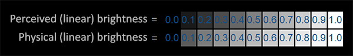
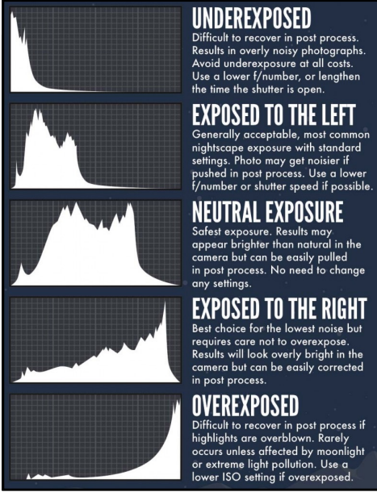
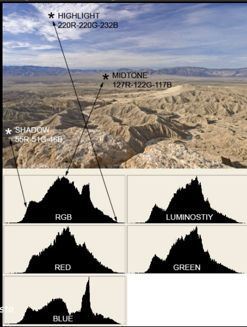
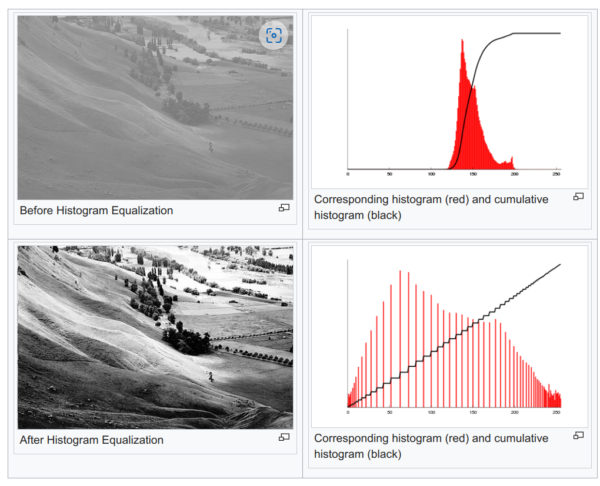
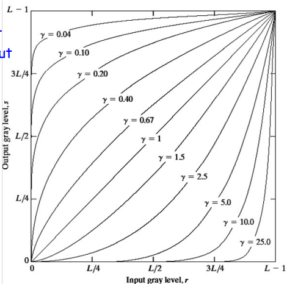
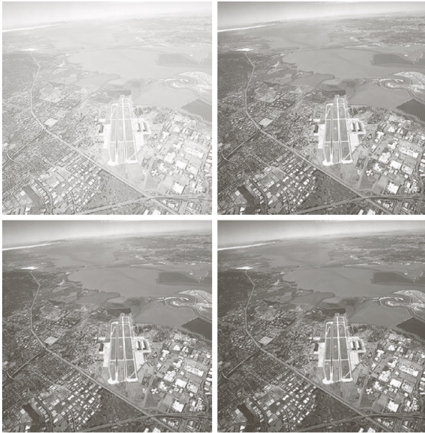
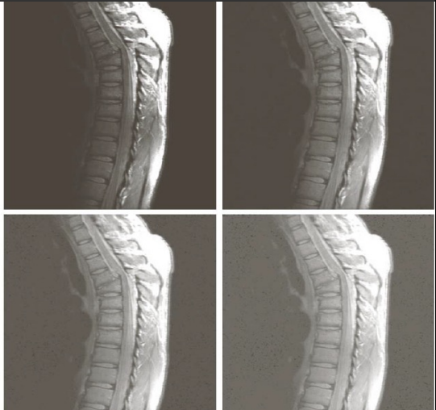
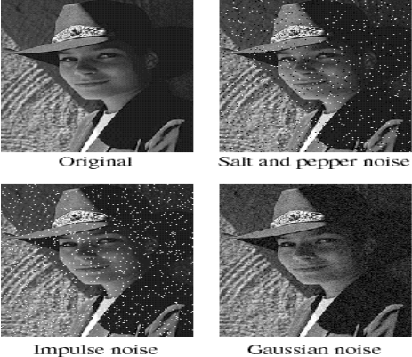

# Image Processing

The human eye perceives brightness logarithmically, not linearly. This means we are more sensitive to changes in dark shades than in light ones.

The top line looks like the correct brightness scale to the human eye, doubling the brightness (from 0.1 to 0.2 for example) does indeed look like it's twice as bright with nice consistent differences. However, when we're talking about the physical brightness of light e.g. amount of photons leaving a light source, the bottom scale actually displays the correct brightness. At the bottom scale, doubling the brightness returns the correct physical brightness, but since our eyes perceive brightness differently (more susceptible to changes in dark colors) it looks weird.

## Luminance

Luminance is the intensity of light emitted from a surface per unit area in a given direction. 

## Histogram

A histogram is a graphical representation of the intensity distribution of an image. It plots the number of pixels for each pixel intensity value. It is a good way to visualize the contrast of an image. It is also useful for image segmentation and thresholding.

Luminance histograms are more accurate than RGB histograms at describing the 
perceived brightness distribution or "luminosity" within an image. Luminosity takes into 
account the fact that the human eye is more sensitive to green light than red or blue 
light. The luminosity of a color is calculated using the following formula:

## Image Contrast

Let us say we have a very bright or very dark image. If we plot the histogram (number of pixels with a particular intensity value vs intensity value) of the image, we will see that the histogram is skewed towards the left or right. This is because the image has a very low contrast. How can we improve the contrast of the image?

One simple way is to normalize the image. This is done by the following formula:

$$ \frac{I - I_{min}}{I_{max} - I_{min}} $$

where $I$ is the image, $I_{min}$ is the minimum intensity value in the image, and $I_{max}$ is the maximum intensity value in the image. This will normalize the image to the range $[0, 1]$.

One problem with this approach is that it does not take into account the distribution of the intensity values in the image. Is stretches the histogram from 0 to 255 but does not spread it out (we are not using all the intensity levels uniformly). This is where histogram equalization comes in.

## Image Enhancement

### Histogram Equalization

Histogram equalization is a technique to improve the contrast of an image by stretching the histogram of the image. This is done by spreading out the most frequent intensity values. This is done by mapping the input intensity values to output intensity values such that the output intensity values are spread out and the histogram of the output image is approximately uniform and hence a linear CDF. This is done by the following formula:

$$ s_k = round(\frac{CDF(k) - CDF_{min}}{M*N - CDF_{min}} \times (L - 1)) $$

where $CDF(k)$ is the cumulative distribution function of the image, $CDF_{min}$ is the minimum value of the CDF, $L$ is the number of intensity levels in the image, MxN is the total number of pixels in the image, and $s_k$ is the output intensity value corresponding to the input intensity value $k$. This gies us a table mapping old intensity values to new intensity values.

This can be understood in the following way, the new intensity value $s_k$ by (L-1) is equal to the normalized CDF of the image at $k$. For example, if the pixels till a value of 220 cover 30% of the CDF (RHS), for a good contrast, this should have been achieved at a pixel value of 30% of (L-1) = 76. Which makes sense since 30% of the cdf should be achieved by 30% of the intensity values.

But keep in mind that we wont get a uniform histogram, since we are just mapping the old intensity values to new intensity values, it is equilvalent to changing the spacing between the pixel intensity bins in the histogram. The histogram will be more uniform than before but not completely uniform. Also the cdf of the new pixel intensity and the old pixel intensity will be the same.

## Adaptive Histogram Equalization

Ordinary histogram equalization uses the same transformation derived from the image histogram to transform all pixels. This works well when the distribution of pixel values is similar throughout the image. However, when the image contains regions that are significantly lighter or darker than most of the image, the contrast in those regions will  not be sufficiently enhanced. Adaptive histogram equalization (AHE) improves on this by transforming each pixel with a transformation function derived from a neighborhood region.

### Log Transformation

Log transformation is used to expand the dark pixels in an image while compressing the higher level pixels. This is done by the following formula:

$$ s = c \cdot log(1 + r) $$
The log transformation maps a narrow range of low input grey level values into a wider range of output values. The inverse log transformation performs the opposite transformation.

### Power Law Transformation (Gamma Correction)

Power law transformations have the following form:

$$ s = c \cdot r^{\gamma} $$
where $c$ is a constant and $\gamma$ is the power law. The power law transformation maps a narrow range of dark input values into a wider range of output values or vice versa. Varying $\gamma$ gives a whole family of curves.

In the above example, the gamma values of a) 1.0 b) 3.0 c) 4.0 and d) 5.0 are used.

In the above example, the gamma values of a) 1.0 b) 0.6 c) 0.4 and d) 0.3 are used.

Gamma greater than 1 will decrease the brightness of the image and gamma less than 1 will increase the brightness of the image. Gamma correction helps in adjusting the brightness levels to align with human vision.Gamma correction primarily affects mid-tones; highlights and shadows are less impacted. The purpose of this adjustment is to align the image's brightness with the non-linear way the human eye perceives light and color.

## Noise Removal

### Types of Noise

#### Salt and Pepper Noise

Random occurrences of black and white pixels

#### Impulse noise

Random occurrences of white pixels only

#### Gaussian noise

Variations of intensity that are drawn from a Gaussian or normal distribution

### Mean Filter

Mean filtering is a simple, intuitive and easy to implement method of smoothing images, i.e. reducing the amount of intensity variation between one pixel and the next. It is often used to reduce noise in images.The idea of mean filtering is simply to replace each pixel value in an image with the mean (`average') value of its neighbors, including itself. This has the effect of eliminating pixel values which are unrepresentative of their surroundings. Mean filtering is usually thought of as a convolution filter. Like other convolutions it is based around a kernel, which represents the shape and size of the neighborhood to be sampled when calculating the mean.
Often a 3×3 square kernel is used, although larger kernels (e.g. 5×5 squares) can be used for more severe smoothing.

Two main problems with mean filtering:

- A single pixel with a very unrepresentative value can significantly affect the mean value of all the pixels in its neighborhood.
- When the filter neighborhood straddles an edge, the filter will interpolate new values for pixels on the edge and so will blur that edge. This may be a problem if sharp edges are required in the output. Both of these problems are tackled by the median filter, which is often a better filter for reducing noise than the mean filter, but it takes longer to compute. In general the mean filter acts as a lowpass frequency filter and, 
therefore, reduces the spatial intensity derivatives present in the image.

### Median Filter

The median filter is normally used to reduce noise in an image, somewhat like the mean filter. However, it often does a better job than the mean filter of preserving “useful” detail in the image.

Advantages of median filter over the mean filter:

- The median is a more robust average than the mean and so a single very unrepresentative pixel in a neighborhood will not affect the median value significantly.
  
- Median filter is much better at preserving sharp edges than the mean filter, since the median value must actually be the value of one of the pixels in the neighborhood, the median filter does not create new unrealistic pixel values when the filter straddles an edge.

## Morphological Operations

Morphological operations are operations that are performed on images based on their shapes. They are normally performed on binary images. It needs two inputs, one is our original image, second one is called structuring element or kernel which decides the nature of operation. Two basic morphological operators are Erosion and Dilation.

### Erosion

The basic idea of erosion is just like soil erosion only, it erodes away the boundaries of foreground object (Always try to keep foreground in white). So what it does? The kernel slides through the image (as in 2D convolution). A pixel in the original image (either 1 or 0) will be considered 1 only if all the pixels under the kernel is 1, otherwise it is eroded (made to zero).

Kernel example for erosion:

$$ \begin{bmatrix} 0 & 1 & 0 \\ 1 & 1 & 1 \\ 0 & 1 & 0 \end{bmatrix} $$

If all pixels under kernel is 1, then only pixel is set to 1, otherwise it is set to 0 ( eroded pixels ).

### Dilation

It is just opposite of erosion. Here, a pixel element is '1' if atleast one pixel under the kernel is '1'. So it increases the white region in the image or size of foreground object increases.

Kernel example for dilation:

$$ \begin{bmatrix} 0 & 1 & 0 \\ 1 & 1 & 1 \\ 0 & 1 & 0 \end{bmatrix} $$

If atleast one pixel under kernel is 1, then pixel is set to 1, otherwise it is set to 0 ( dilated pixels ).

### Opening

In cases like noise removal, erosion is followed by dilation. Because, erosion removes white noises, but it also shrinks our object. So we dilate it. Since noise is gone, they won't come back, but our object area increases. It is also useful in joining broken parts of an object.

### Closing

Closing is reverse of Opening, Dilation followed by Erosion. It is useful in closing small holes inside the foreground objects, or small black points on the object.

## Image Sharpening

### Unsarp Masking

Typically, an image is sharpened by adding unsharp mask to the original image. The unsharp mask is a blurred version of the image that is subtracted from the original image. The amount of sharpening depends on the amount of blurring. 

Original Image + (Original Image - Blurred Image) = Sharpened Image

### Laplacian Filter

The Laplacian filter is a second derivative edge detector. It computes the second derivatives of the image at each pixel, and then finds the zero crossings of the second derivatives to locate edges. The Laplacian filter is isotropic, that is, it has the same response for edges in all directions. The Laplacian filter is often applied to an image that has first been smoothed with a Gaussian smoothing filter in order to reduce its sensitivity to noise.

$$ \nabla^2 f = \frac{\partial^2 f}{\partial x^2} + \frac{\partial^2 f}{\partial y^2} $$

For discrete images, the Laplacian filter in 1D is:

<!-- <!-- do f2 / do x2  = f(x+1) + f(x-1) - 2f(x) --> -->

$$ \nabla^2 f = f(x+1) + f(x-1) - 2f(x)$$

For discrete images, the Laplacian filter in 2D is:

$$ \nabla^2 f = f(x+1, y) + f(x-1, y) + f(x, y+1) + f(x, y-1) - 4f(x, y) $$

Filter:

$$ \begin{bmatrix} 0 & 1 & 0 \\ 1 & -4 & 1 \\ 0 & 1 & 0 \end{bmatrix} $$

Sharpened image = Original image - Laplacian filter

Final filter:

$$ \begin{bmatrix} 0 & -1 & 0 \\ -1 & 5 & -1 \\ 0 & -1 & 0 \end{bmatrix} $$

## Edge Detection

### Sobel Operator

The Sobel operator is a discrete differentiation operator. It computes an approximation of the gradient of the image intensity function. At each point in the image, the result of the Sobel–Feldman operator is either the corresponding gradient vector or the norm of this vector. The Sobel–Feldman operator is based on convolving the image with a small, separable, and integer valued filter in horizontal and vertical direction and is therefore relatively inexpensive in terms of computations. On the other hand, the gradient approximation that it produces is relatively crude, in particular for high-frequency variations in the image.

The Sobel operator kernel in the horizontal direction is:

$$ \begin{bmatrix} -1 & 0 & 1 \\ -2 & 0 & 2 \\ -1 & 0 & 1 \end{bmatrix} $$

The Sobel operator kernel in the vertical direction is:

$$ \begin{bmatrix} -1 & -2 & -1 \\ 0 & 0 & 0 \\ 1 & 2 & 1 \end{bmatrix} $$

## Dithering

Our eyes work as a low pass filter, so the high frequency components are not very important.
We can take advantage of this fact and create a gray looking image by interleaving black and white pixels. This is called dithering.

Numberphile Videos explaning the concepts [1](https://www.youtube.com/watch?v=IviNO7iICTM)
[2](https://www.youtube.com/watch?v=ico4fJfohMQ)

<!-- ## Hough Transform -->
## Image Compression

The simplest way to compress an image is to quantize it, but instead of quantizing the contrast values, a better way is to quantize the frequency components.

Usually photographs have more of low frequency components and less of high frequency components. This is because the low frequency components are the overall color of the image and the high frequency components are the edges and details of the image. So we can compress the image by removing the high frequency components. We convert the image into the frequency domain using the Discrete Cosine Transform (DCT). This is similar to the Fourier Transform but uses only cosines.

## Image file formats

### JPEG

JPEG is a lossy compression algorithm. It uses the Discrete Cosine Transform (DCT) to convert the image into the frequency domain. It then quantizes the frequency components. It then uses Huffman coding to compress the image. It is a lossy compression algorithm because it discards the high frequency components. The amount of compression can be controlled by changing the quantization factor. The higher the quantization factor, the more the compression and the more the loss of information.

### PNG

PNG is a lossless compression algorithm used for storing logos and other images that need to be lossless.

### JPG vs JPEG

JPEG is a standard for image compression. JPG is a file extension for JPEG files.

## Fourier Transform

Any periodic function can be expressed as a sum of sines or cosines or both of different frequencies. This is the Fourier series. The Fourier transform is a generalization of this idea to non-periodic functions. The Fourier transform of a function is a function that tells you how much of each frequency is present in the original function.

$$ f(x) = \int_{-\infty}^{\infty} F(k) e^{-2\pi i k x} dk $$

Fourier transform and Fourier series are two manifestations of a similar idea, namely, to write general functions as "superpositions" (whether integrals or sums) of some special class of functions. Exponentials $x \to e^{itx}$ (or, equivalently, expressing the same thing in sines and cosines via Euler's identity $e^{iy} = \cos y + i\sin y$) have the virtue that they are eigenfunctions for differentiation, that is, differentiation just multiplies them: $\frac{d}{dx}e^{itx} = it \cdot e^{itx}$. This makes exponentials very convenient for solving differential equations, for example.

A periodic function provably can be expressed as a "discrete" superposition of exponentials, that is, a sum. A non-periodic, but decaying, function does not admit an expression as a discrete superposition of exponentials, but only a continuous superposition, namely, the integral that shows up in Fourier inversion for Fourier transforms.

In both cases, there are several technical points that must be addressed, somewhat different in the two situations, but the issues are very similar in spirit.

## References

https://learnopengl.com/Advanced-Lighting/Gamma-Correction