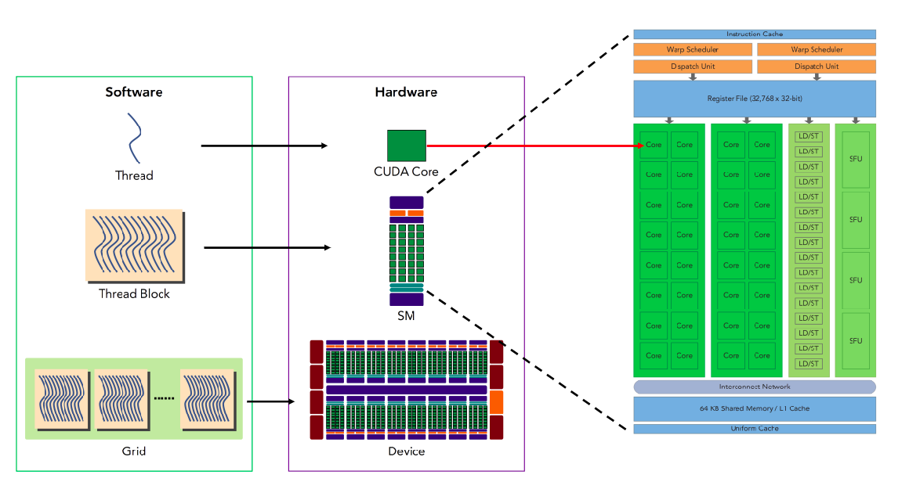
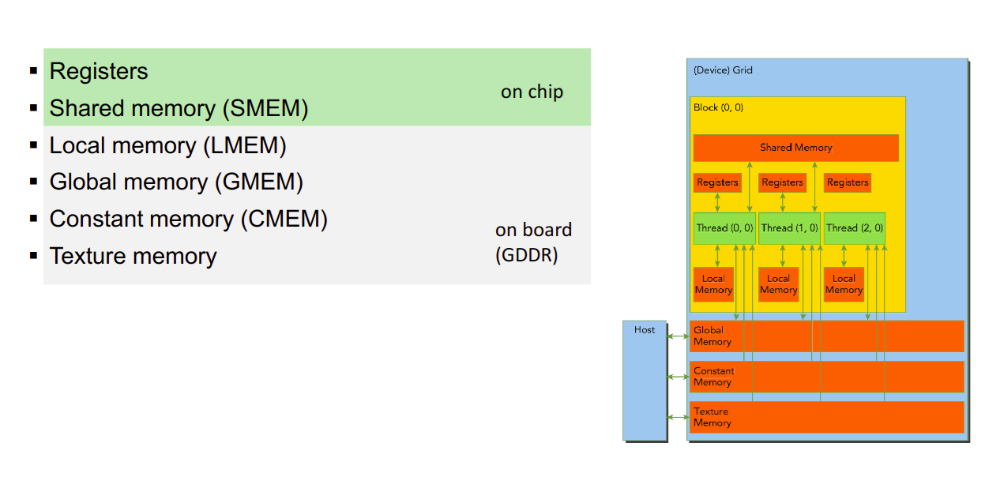

GPUs go brrrr...

## Resources

### Practice exercises and lecture by NVIDIA and OLCF
https://www.olcf.ornl.gov/cuda-training-series/ (https://www.youtube.com/playlist?app=desktop&list=PL6RdenZrxrw-zNX7uuGppWETdxt_JxdMj)
https://github.com/olcf/cuda-training-series/tree/master/exercises

### CUDA Mode Discord
https://github.com/cuda-mode/lectures

### NVIDIA CUDA C Programming Guide
https://docs.nvidia.com/cuda/cuda-c-programming-guide/index.html#compute-capability

### Book
Programming Massively Parallel Processors: A Hands-on Approach by David B. Kirk and Wen-mei W. Hwu 4th Edition


### CUDA Toolkit documentation
https://docs.nvidia.com/cuda/index.html

---


## Streaming Multiprocessor (SM)

It is similar to CPU core HW. The threads of a thread block execute concurrently on one multiprocessor. As thread blocks terminate, new blocks are launched on the vacated multiprocessors.

SMs have different cores/units that can execute different types of instructions. For example, they have units that do integer operations, load-store units, units that do single precision floating point operations, and units that do double precision floating point operations. The number of units for each type of operation can vary between different GPUs. Usually, the single and half precision floating point operations are done using the same units. 

Tensor cores are a special type of core that can do matrix multiplication and addition operations. They are used in deep learning applications.

Both Double precision and Single precision floating point operations can be used simultaneously on the same GPU.

Titan GPUs are more for scientific computing with double precision floating point operations, therefore the ratio of single precision to doube precision is lower. However the RTX GPUs are more for gaming and and have a higher ratio of single precision to double precision operations. 

## Warps and Thread Blocks

Once a thread block is scheduled to an SM, threads in the thread block are further partitioned into
warps. A warp consists of 32 consecutive threads, all threads in a warp are executed in Single Instruction Multiple Thread (SIMT) fashion. That is, all threads execute the same instruction, and each thread carries out that operation on its own private data. A threadblock consists of up to 1024 threads.

Data within a warp can be easily broadcasted to other threads. So if each thread in a warp is accessing the same data, it will not access the same data it multiple times due.
 <!-- However, It decreases current SM being used and as each SM has a limited amount of resources such as registers, shared memory, and maximum number of threads it can handle concurrently, it will lead to resource wastage. -->



<!-- Kernel <<< 8, 1024>>> () One or two SMs can run even if your GPU has 4 SMs
Kernel <<< 8, 256>>> () 4 SMs can run simultaneously -->
Generally golden rule, create only 2 warps ~ 8 warps per threadblock


All the SMs in a GPU processor share some resources such as registers and shared memory. Some of the resources are not independent among SM. There is no simple way to determine how many SMs can run concurrently. One SM takes too many resources and the other SMs cannot run. To obtain the number accurately, we need to run the CUDA profiler. Also, the total number of warps, which can run concurrently is limited by 64 warps per SM. 1024 threads (32 warps) are assigned to one SM. Two SMs (64 warps) is possible at the
maximum.


A group of threads executed physically in parallel (SIMD). The warp size is 32 threads. Every consecutive 32 threads in a threadblock is assigned into a warp ex: Kernel0 <<< 5, 40 >>> kernel0: total 200 threads (5*40) , 10 warps (not 7 warps) 40 threads: 2 warps 0-31 -> warp0, 32-39 -> warp1

## Grid and Kernel
Grid is a group of threadblocks which executes a single kernel. Multiple Grids are created if you call multiple kernels.

For example, `dim3 blocks(3,4)` creates

```
         x=0      x=1      x=2
y=0   (0,0)    (1,0)    (2,0)
y=1   (0,1)    (1,1)    (2,1)
y=2   (0,2)    (1,2)    (2,2)
y=3   (0,3)    (1,3)    (2,3)
```

In CUDA X and Y axis are the same but threadIdx.x gives col and threadIdx.y gives row. Hence we have a dim3(cols, rows) format.
But while declaring memory in CUDA which uses C syntax, we have `int arr[rows][cols]`. So if the dimension of out block is dim3(4,3), and we declare a SMEM of same size, we need to declare it as `__shared__ int smem[3][4]`. Therefore is simple to use 1d array

## Predefined kernel variables (1/3)

If you call a kernel function, predefined kernel variables are assigned blockIdx, threadIdx, blockDim, gridDim, etc. 
### blockIdx 
block index within a grid
### threadIdx
thread index within a threadblock
ex: kernel<<< 2, 4>>> ()
blockIdx.x=0, blockIdx.x=1 (2 threadblocks)
threadIdx.x = 0~3 (4 threads/threadblock)



## Warp Scheduler

When a block is deposited on a SM, a number of things happen. Among those are included reservations for the various resources that the block will require. These resources include warp slots, registers, and shared memory, amongst others. The reservation of warp slots on a modern GPU is static, amongst the warp schedulers. If a SM has 4 warp schedulers, the warps from a newly deposited block will be statically allocated amongst the 4 warp schedulers. If there is no other activity on the SM at that point, we would presume that the warps would be evenly divided. Static here means that warp ownership does not move from one warp scheduler to another warp scheduler during the lifetime of the warp.


## Latency Hiding

Each clock cycle of GPU can do load/store, and arithmetic operations. The load/store can always be done and don't have to wait for the result of the previous operation. However the most latency-sensitive operation in a GPU is memory access, especially global memory access (GMEM). 

The GPU is designed to hide memory latency by having multiple warps in flight at any given time. When a warp is waiting for data from memory, the GPU will switch to another warp that is ready to execute. This is why it is important to have enough warps in flight to hide memory latency. If there are not enough warps in flight, the GPU will be idle waiting for data from memory.

Also, not all warps can be scheduled at the same time. SMs have warp schedulers that decide which warp to execute next. At each time, each SM can have up to 64 (may change depending on the architecture) warps in flight. Therefore, total number of threads per SM is 64 * 32 = 2048 threads. Also, if a GPU has 80 SMs, the total number of threads that is advised for maximum performarmance is 2048 * 80 = 163840 threads.


## CUDA Softwares

NVIDIA driver: The driver is the software that enables the communication between the hardware and the software. It is the first thing you need to install on your system to use your NVIDIA GPU.

CUDA toolkit: The CUDA toolkit is a software development kit that allows you to write and compile CUDA code. It includes the CUDA runtime, the CUDA compiler, the CUDA libraries, and other tools.

cuDNN: The NVIDIA CUDA Deep Neural Network library (cuDNN) is a GPU-accelerated library for deep neural networks. It provides highly tuned implementations for standard routines such as convolutions, normalization, activation functions, and tensor transformations.

NCCL: The NVIDIA Collective Communications Library (NCCL) is a library of standard collective communication routines that have been optimized for NVIDIA GPUs. It provides routines such as all-gather, all-reduce, broadcast, reduce, and reduce-scatter.

NVCC is the CUDA compiler. It is used to compile CUDA code into an executable that can be run on the GPU. It is a wrapper around the host compiler (e.g. GCC, Clang) and the CUDA runtime. It is used to compile both the host code (C/C++) and the device code (CUDA).


https://docs.nvidia.com/cuda/cuda-runtime-api/driver-vs-runtime-api.html

### CUDA and PyTorch:

The PyTorch binaries ship with their own CUDA runtime (as well as cuDNN, NCCL etc.) and don’t need a locally installed CUDA toolkit to execute code but only a properly installed NVIDIA driver. The local CUDA toolkit (with the compiler) will be used if building PyTorch from source or a custom CUDA extension.

## CUDA Profiling

- nsys is the command line interface for Nsight Systems which supports system wide profiling.

- ncu/nv-nsight-cu-cli is the command line interface for Nsight Compute which supports kernel profiling. Note that the Nsight Compute CLI command is renamed from nv-nsight-cu-cli to ncu.

- nvprof is the command line interface for the NVIDIA Visual Profiler which supports profiling and tracing of CUDA applications. It is deprecated in CUDA 11.0 and will be removed in a future release.

## Optimizing CUDA code

The two main ways to reduce or hide CUDA latency is to have a high memory bandwidth usage and and a high number of warps or threads in flight. 

Let us look at the example below for adding the row or colums of a matrix. Intuitively, the row sum should be faster than the column sum because the memory access is more coalesced. 

But if we profile the code, we see that the column sum is faster than the row sum. This is because the column sum has a higher memory bandwidth usage.

```c

// matrix row-sum kernel
__global__ void row_sums(const float *A, float *sums, size_t ds){

  int idx = threadIdx.x + blockIdx.x*block_size;
  if (idx < ds){
    float sum = 0.0f;
    for (size_t i = 0; i < ds; i++)
      sum += A[i + idx*ds];
    sums[idx] = sum;
}}

// matrix column-sum kernel
__global__ void column_sums(const float *A, float *sums, size_t ds){

  int idx = threadIdx.x + blockIdx.x*block_size;
  if (idx < ds){
    float sum = 0.0f;
    for (size_t i = 0; i < ds; i++)
      sum += A[i*ds + idx];  
    sums[idx] = sum;
}}

```

| Metric                     | Row Sums Kernel  | Column Sums Kernel |
|----------------------------|------------------|---------------------|
| Duration                   | 22.47 ms         | 4.69 ms             |
| Memory Throughput          | 41.54%           | 86.47%              |
| DRAM Throughput            | 19.49%           | 86.47%              |
| L1/TEX Cache Throughput    | 83.08%           | 25.22%              |
| L2 Cache Throughput        | 8.87%            | 31.95%              |
| Achieved Occupancy         | 42.06%           | 52.95%              |


We can reduce the row sum latency by using shared memory and adding the elements using parallel reduction. 

```c

__global__ void row_sums(const float *A, float *sums, size_t ds){

  int idx = threadIdx.x;
  __shared__ float sdata[block_size];
  sdata[idx] = 0.0f;

  for(int i = 0; i < ds/blockDim.x; i++) sdata[idx] += A[ds*blockIdx.x + i*blockDim.x + idx];
  
  for(int s = blockDim.x/2; s > 0; s/=2){
    __syncthreads();
    if (idx < s) sdata[idx] += sdata[idx + s];
  }
  
  if (idx == 0) sums[blockIdx.x] = sdata[0];

}

```

## Paged and Pinned Memory

Paged memory is memory that can be swapped out to disk by the operating system, while pinned memory is memory that is not swapped out to disk by the operating system. A Page-locked memory is never swapped out of main memory. This means that a page locked in physical memory is guaranteed to be present in RAM all the time. However, there is no guarantee that the page fault will never happen, since the kernel is still free to move the page within the physical memory.

A pinned memory is a locked memory that is pinned at a particular page frame location. This means that the pinned page can neither be swapped out of main memory nor be moved within the physical RAM and hence it is guaranteed that the page fault will never happen. This is an ideal requirement for hard realtime applications


The GPU always must DMA from pinned memory. If you use malloc() for your host data, then it is in pageable (non-pinned memory). When you call cudaMemcpy(), the CUDA driver has to first memcpy the data from your non-pinned pointer to an internal pinned memory pointer, and then the host->GPU DMA can be invoked.

If you allocate your host memory with cudaMallocHost and initialize the data there directly, then the driver doesn’t have to memcpy from pageable to pinned memory before DMAing – it can DMA directly.

That is why it is faster.

Using a lot of pinned memory can cause performance problems for the operating system. (“a lot” is hard to quantify unfortunately, which is another drawback). Pinned memory is great if you are going to be copying data back and forth between the CPU and GPU quite often but may not be that beneficial if you’re not doing many transfers…

https://stackoverflow.com/questions/62332067/vmlck-locked-memory-vs-vmpin-pinned-memory-in-proc-pid-status
https://forums.developer.nvidia.com/t/question-about-page-locked-memory/9032/2

## Bank Conflicts

Shared memory is divided into 32 banks. Each succesive word(32 bits) in stored different bank upto bank the last bank (32), so word_32 in in bank_0. Each bank can read or write one 32-bit word per clock cycle. If multiple threads in the same warp access the same bank, a bank conflict occurs. This means that the bank has to serialize the accesses, which can slow down the memory access. On the contrary, if each thread in a warp access the same word, it will be broadcasted to all the threads.

**This is on the warp level only** If multiple threads from different warps in the same block read from the same bank, conflict does not occur.
- https://www.youtube.com/watch?v=CZgM3DEBplE


## Memory Coalescing

Sequential memory accesses by threads that are part of the same warp can be grouped and executed as one. This is referred to as global memory coalescing.

# Reduction (Sum of elements in a vector)

Highly recommended to understand many of the concepts below: https://developer.download.nvidia.com/assets/cuda/files/reduction.pdf


# Matmul

`C(m,n) = A (m,k) x B(k,n)`

## SMEM

Instead of each thread reading 1 row from A and 1 row from B, each block loads a tile (BLOCK_SIZE x BLOCK_SIZE) from both A and B into SMEM As and Bs. Each thread in the blocks uses the SMEM elements to compute partial sum and repeats this K/BLOCK_SIZE times. Here each warp computes 32 elements.

## 1D blocktiling

While using shared memory approach with BLOCK_SIZE of 32, we load 32x32 elements from both A and B into smem As and Bs. What if we load 64x8 and 8x64 elements from A and B resp. Now the tile size of C being computed is 64x64. Which means we can compute more elements per elements in SMEM. Also this allows us to use a single thread for more (8 times) work. Here each warp computes 32 x 8 elements.

## 2D blocktiling


# Tensor Cores

One of the first blogs in Tensor cores: https://developer.nvidia.com/blog/programming-tensor-cores-cuda-9/
Good intro video: https://www.youtube.com/watch?v=Yt1A-vaWTck
CUDA Mode video, gold: https://www.youtube.com/watch?v=hQ9GPnV0-50&t=3968s


Followup on Simons Blog written for H100: https://cudaforfun.substack.com/p/outperforming-cublas-on-h100-a-worklog#footnote-2-152317396 https://www.youtube.com/watch?v=ErTmTCRP1_U