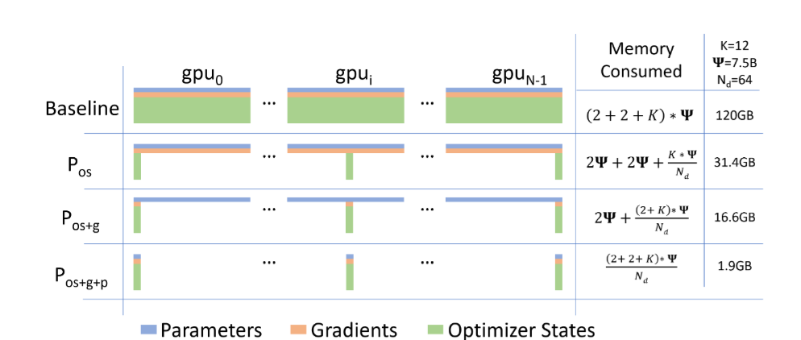

---
title: "Distributed Training"
category: Deep Learning, Computer Vision, NLP
date:   2024-07-28 15:20:28 +0530
summary:
description: 
cover:
  image:
  alt:
  caption: 
  relative: true
showtoc: true
draft: false
math: true
---

Recommended Readings:
- https://huggingface.co/docs/transformers/v4.15.0/en/parallelism

Mofified version of https://colossalai.org/docs/concepts/paradigms_of_parallelism/

Introduction
With the development of deep learning, there is an increasing demand for parallel training. This is because that model and datasets are getting larger and larger and training time becomes a nightmare if we stick to single-GPU training. In this section, we will provide a brief overview of existing methods to parallelize training. 

## Data Parallel
Data parallel is the most common form of parallelism due to its simplicity. In data parallel training, the dataset is split into several shards, each shard is allocated to a device. This is equivalent to parallelize the training process along the batch dimension. Each device will hold a full copy of the model replica and trains on the dataset shard allocated. After back-propagation, the gradients of the model will be all-reduced so that the model parameters on different devices can stay synchronized.

## Model Parallel

In data parallel training, one prominent feature is that each GPU holds a copy of the whole model weights. This brings redundancy issue. Another paradigm of parallelism is model parallelism, where model is split and distributed over an array of devices. There are generally two types of parallelism: tensor parallelism and pipeline parallelism. Tensor parallelism is to parallelize computation within an operation such as matrix-matrix multiplication. Pipeline parallelism is to parallelize computation between layers. Thus, from another point of view, tensor parallelism can be seen as intra-layer parallelism and pipeline parallelism can be seen as inter-layer parallelism.

### Tensor Parallel

Tensor parallel training is to split a tensor into N chunks along a specific dimension and each device only holds 1/N of the whole tensor while not affecting the correctness of the computation graph. This requires additional communication to make sure that the result is correct.

Taking a general matrix multiplication as an example, let's say we have C = AB. We can split B along the column dimension into [B0 B1 B2 ... Bn] and each device holds a column. We then multiply A with each column in B on each device, we will get [AB0 AB1 AB2 ... ABn]. At this moment, each device still holds partial results, e.g. device rank 0 holds AB0. To make sure the result is correct, we need to all-gather the partial result and concatenate the tensor along the column dimension. In this way, we are able to distribute the tensor over devices while making sure the computation flow remains correct.

This has the advantage of parrallelizing the computation of multiple layers. 

### Pipeline Parallel
The core idea of pipeline parallelism is that the model is split by layer into several chunks, each chunk is given to a device. During the forward pass, each device passes the intermediate activation to the next stage. During the backward pass, each device passes the gradient of the input tensor back to the previous pipeline stage. This allows devices to compute simultaneously, and increases the training throughput. One drawback of pipeline parallel training is that there will be some bubble time where some devices are engaged in computation, leading to waste of computational resources.

## Optimizer-Level Parallel
Another paradigm works at the optimizer level, and the current most famous method of this paradigm is ZeRO which stands for zero redundancy optimizer. ZeRO works at three levels to remove memory redundancy (fp16 training is required for ZeRO):

Level 1: The optimizer states are partitioned across the processes
Level 2: The reduced 32-bit gradients for updating the model weights are also partitioned such that each process only stores the gradients corresponding to its partition of the optimizer states.
Level 3: The 16-bit model parameters are partitioned across the processes

## Parallelism on Heterogeneous System
The methods mentioned above generally require a large number of GPU to train a large model. However, it is often neglected that CPU has a much larger memory compared to GPU. On a typical server, CPU can easily have several hundred GB RAM while each GPU typically only has 16 or 32 GB RAM. This prompts the community to think why CPU memory is not utilized for distributed training.

Recent advances rely on CPU and even NVMe disk to train large models. The main idea is to offload tensors back to CPU memory or NVMe disk when they are not used. By using the heterogeneous system architecture, it is possible to accommodate a huge model on a single machine.

## DDP and FSDP

### Distributed Data Parallel (DDP)

DDP distributes the model across multiple GPUs and each GPU has a copy of the model. The gradients are computed on each GPU and then are averaged across all the GPUs. The averaged gradients are then used to update the model.

Since each GPU has a different copy of gradients, we need to average them to get the final gradients. This is done using the all_reduce function. The all_reduce function is a collective communication operation that takes the input from all the GPUs and then computes the sum of the inputs on all the GPUs. 

### Fully Sharded Data Parallel (FSDP)

Good Tutorial: https://lightning.ai/docs/pytorch/stable/advanced/model_parallel/fsdp.html

FSDP is a new parallelization technique that is designed to work with large models that do not fit into the memory of a single GPU. It divides the model and their respective optimizer parameters into shards and each shard is placed on a different GPU. For foward pass, all_gather operation is used to gather all the model shards on all the GPUs. The forward pass is then performed on all the GPUs. The extra shards are then deleted. 

During backward pass, the model shards are again collected using all_gather and the gradients are computed on all the GPUs. The extra shards are then deleted. Now we use reduce_scatter to average the gradients of each shard across all the GPUs and then update the model using the optimizer shards on each GPU.

During forward and backward pass, the model needs to be replicated on all the GPUs but the optimizer parameters are not replicated. The optimizer parameters are only present on the GPU where the original model shard is present. This is because the optimizer parameters only need the gradients for its model shard which is collected using reduce_scatter after the backward pass.

The activations for all layers are always stored on the respective GPUs which may take up a lot of memory. Activation checkpointing reduces the memory usage by recomputing the activations during the backward pass. 
Only the input to the layer is stored and the rest of the activations are recomputed during the backward pass. This reduces the memory usage but increases the computation time.

fsdp_sharding_strategy: [1] FULL_SHARD (shards optimizer states, gradients and parameters), [2] SHARD_GRAD_OP (shards optimizer states and gradients), [3] NO_SHARD (DDP), [4] HYBRID_SHARD (shards optimizer states, gradients and parameters within each node while each node has full copy), [5] HYBRID_SHARD_ZERO2 (shards optimizer states and gradients within each node while each node has full copy).

## Ring AllReduce

Connect all nodes in a ring like fashion and each node sends its gradients to the next node. At each step the gradients are reduced and the reduced gradients are sent to the next node. This process is repeated until the gradients reach the original node.

https://towardsdatascience.com/visual-intuition-on-ring-allreduce-for-distributed-deep-learning-d1f34b4911da